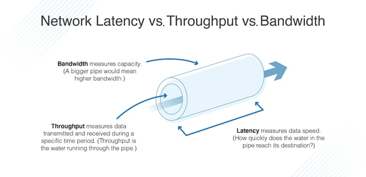

# 네트워크

> 네트워크란?
> 두 대 이상의 장치가 서로 연결돼서 정보를 주고 받을 수 있는 통신망

## 네트워크에서 패킷이란 무엇을 의미하나요?

<details>
<summary>일단 답해보기</summary>
<div markdown="1">

```diff
- 네트워크에서 패킷이란, 전달되는 메시지 단위라고 볼 수 있을 것 같다.
+ 네트워크에서 패킷이란, 전달되는 데이터 단위라고 볼 수 있을 것 같다.
- 네트워크 각 계층에 따라 메시지를 표현하는 방식이 다른데, 응용 계층과 전송 계층 사이의 IP 계층 메시지 단위가 패킷이라고 알고 있다.
+ 네트워크 각 계층에 따라 데이터를 표현하는 방식이 다른데, IP 계층 데이터 단위를 패킷이라고 한다.
```

</div>
</details>

### 패킷이란?

- package + bucket
- 데이터의 전송 단위

### 패킷의 구조

- 헤더
  - 패이로드를 실행하기 위한 메타 데이터
- 패이로드
  - 패킷에 의해 전송되는 실제 데이터
- 트레일러
  - 오류 검사 정보 - 패킷이 온전히 전송되었는지 검사하는 체크섬 등

## 네트워크에서 처리량은 무엇을 의미하나요?

<details>
<summary>일단 답해보기</summary>
<div markdown="1">

```diff
처리량은 무엇을 의미하는 지 설명하기는 어려우나, 개발자도구 throttling 메뉴에서 처리량을 줄이기 위해 network 속도를 제어해본 적이 있다.
```

</div>
</details>

### 처리량(throughput)이란?

- 네트워크를 통해 일정 시간 동안 전달되는 데이터의 양

### 처리량 특성

- 네트워크 성능을 측정하는 지표
- 네트워크 속도를 결정
- 단위 - bps(bits per second)
- 초당 전송 또는 수신되는 비트 수
  > 원래는 네트워크 처리량을 초당 비트 수(bps)로 측정했습니다. 그러나 데이터 전송 기술이 발전함에 따라 이제 훨씬 더 높은 가치를 달성할 수 있습니다. 따라서 초당 킬로바이트(KBps), 초당 메가바이트(MBps), 심지어 초당 기가바이트(GBps) 단위로 처리량을 측정할 수 있습니다. 1바이트는 8비트와 같습니다. \_AWS
- 영향을 미치는 요인
  - 대역폭
  - 네트워크 처리 능력
  - 패킷 손실
  - 네트워크 토폴로지

## 지연시간이란 무엇인가요?

<details>
<summary>일단 답해보기</summary>
<div markdown="1">

```diff
네트워크 통신 시 걸리는 시간
```

</div>
</details>

### 지연시간이란?

- 네트워크를 통해 데이터를 전송하는 데 걸리는 시간
- 하나의 패킷이 목적지에 도달하는데 걸리는 시간

### 지연시간 특성

- 네트워크 성능을 측정하는 지표
- 네트워크 속도를 결정
- 단위 - ms
- 영향을 미치는 요인
  - 지리적 거리
  - 네트워크 정체
  - 전송 프로토콜
  - 네트워크 인프라

### 처리량은 어떤 상황에 영향을 받나요?

- 지연 시간
  - 지연 시간이 길면 데이터 전송 및 도착 시간이 더 오래 걸리기 때문에 처리량이 적어질 수 있다.
- 대역폭 (Bandwidth)
  : 특정 기간 동안 송수신할 수 있는 데이터의 양
  
  - 대역폭이 클수록 더 많은 데이터를 동시에 전송할 수 있어 처리량이 많아진다.
  - 네트워크 용량이 전송 매체의 최대 대역폭에 도달하면 처리량이 해당 제한을 초과할 수 없다.
- 네트워크 처리 능력
  - 네트워크 디바이스에는 처리 성능을 향상시키는 특수 하드웨어 또는 소프트웨어 최적화가 있음 (ex. 전용 애플리케이션별 집접 회로 또는 소프트웨어 기반 패킷 처리 엔진)
  - 이러한 최적화를 통해 디바이스는 더 많은 양의 트래픽과 더 복잡한 패킷 처리 태스크를 처리할 수 있으므로 처리량이 향상됨
- 패킷 손실
  - 네트워크 정체, 하드웨어 결함 또는 잘못 구성된 네트워크 디바이스 등 다양한 이유로 발생
  - 패킷이 손실되면 다시 전송해야 하므로 처리량 감소
- 네트워크 토폴로지
  - 노드와 링크가 어떻게 배치되어 있는지에 대한 방식이자 연결 형태
  - 잘 설계된 네트워크 토폴로지는 데이터 전송을 위한 다중 경로를 제공하고 트래픽 병목 현상을 줄이며 처리량을 증가시킴

[참고 자료]

- https://aws.amazon.com/ko/compare/the-difference-between-throughput-and-latency/
- https://www.dnsstuff.com/latency-throughput-bandwidth

### 네트워크 병목현상은 무엇인가요?

- 병목 현상: 전체 시스템의 성능이나 용량이 하나의 구성 요소로 인해 제한을 받는 현상
- 서비스에서 이벤트를 열었을 때 트래픽이 많이 생기고 그 트래픽을 잘 관리하지 못하면 병목 현상이 생겨 사용자는 웹 사이트로 들어가지 못할 수 있음

### TCP/IP 가 무엇인가요? 각 계층에 대해서 설명할 수 있나요?

- TCP/IP: 인터넷과 이와 유사한 컴퓨터 네트워크 사이에서 정보를 주고받는 데 이용되는 통신 프로토콜의 모음
- 일반적으로 4개의 계층으로 구성

  1. 응용 계층

  - 응용 프로그램이 사용되는 프로토콜 계층
  - 웹 서비스, 이메일 등 서비스를 실질적으로 사람들에게 제공하는 층
  - 데이터 단위 - 메시지

  2. 전송 계층

  - 송신자와 수신자를 연결하는 통신 서비스를 제공
  - 애플리케이션과 인터넷 계층 사이의 데이터가 전달될 때 중계 역할
  - 데이터 단위 - 세그먼트

  3. 인터넷 계층

  - 네트워크 간의 데이터 패킷 전달을 담당
  - 데이터 단위 - 패킷

  4. 네트워크 인터페이스 계층

  - 물리적인 네트워크 연결을 담당
  - 데이터 단위 - 프래임

[참고 자료]

- https://nordvpn.com/ko/blog/tcp-ip-protocol/?srsltid=AfmBOoo1GrvmF3IAYiaFPDpm_1TwTroSqkjzHK94V6Q6umb6FicP43nd
- https://m.blog.naver.com/hai0416/221592953663

