# 네트워크

> 네트워크란?
> 두 대 이상의 장치가 서로 연결돼서 정보를 주고 받을 수 있는 통신망

## 네트워크에서 패킷이란 무엇을 의미하나요?

<details>
<summary>일단 답해보기</summary>
<div markdown="1">

```diff
- 네트워크에서 패킷이란, 전달되는 메시지 단위라고 볼 수 있을 것 같다.
+ 네트워크에서 패킷이란, 전달되는 데이터 단위라고 볼 수 있을 것 같다.
- 네트워크 각 계층에 따라 메시지를 표현하는 방식이 다른데, 응용 계층과 전송 계층 사이의 IP 계층 메시지 단위가 패킷이라고 알고 있다.
+ 네트워크 각 계층에 따라 데이터를 표현하는 방식이 다른데, IP 계층 데이터 단위를 패킷이라고 한다.
```

</div>
</details>

### 패킷이란?

- package + bucket
- 데이터의 전송 단위

### 패킷의 구조

- 헤더
  - 패이로드를 실행하기 위한 메타 데이터
- 패이로드
  - 패킷에 의해 전송되는 실제 데이터
- 트레일러
  - 오류 검사 정보 - 패킷이 온전히 전송되었는지 검사하는 체크섬 등

## 네트워크에서 처리량은 무엇을 의미하나요?

<details>
<summary>일단 답해보기</summary>
<div markdown="1">

```diff
처리량은 무엇을 의미하는 지 설명하기는 어려우나, 개발자도구 throttling 메뉴에서 처리량을 줄이기 위해 network 속도를 제어해본 적이 있다.
```

</div>
</details>

### 처리량(throughput)이란?

- 네트워크를 통해 일정 시간 동안 전달되는 데이터의 양
- 특정 시간 동안 실제로 네트워크를 통과할 수 있는 평균 데이터 양

### 처리량 특성

- 네트워크 성능을 측정하는 지표
- 네트워크 속도를 결정
- 단위 - bps(bits per second)
- 초당 전송 또는 수신되는 비트 수
  > 원래는 네트워크 처리량을 초당 비트 수(bps)로 측정했습니다. 그러나 데이터 전송 기술이 발전함에 따라 이제 훨씬 더 높은 가치를 달성할 수 있습니다. 따라서 초당 킬로바이트(KBps), 초당 메가바이트(MBps), 심지어 초당 기가바이트(GBps) 단위로 처리량을 측정할 수 있습니다. 1바이트는 8비트와 같습니다. \_AWS
- 영향을 미치는 요인
  - 대역폭
  - 네트워크 처리 능력
  - 패킷 손실
  - 네트워크 토폴로지

## 지연시간이란 무엇인가요?

<details>
<summary>일단 답해보기</summary>
<div markdown="1">

```diff
네트워크 통신 시 걸리는 시간
```

</div>
</details>

### 지연시간이란?

- 네트워크를 통해 데이터를 전송하는 데 걸리는 시간
- 하나의 패킷이 목적지에 도달하는데 걸리는 시간

### 지연시간 특성

- 네트워크 성능을 측정하는 지표
- 네트워크 속도를 결정
- 단위 - ms
- 영향을 미치는 요인
  - 지리적 거리
  - 네트워크 정체
  - 전송 프로토콜
  - 네트워크 인프라

## 처리량은 어떤 상황에 영향을 받나요?

- 지연 시간
  - 지연 시간이 길면 데이터 전송 및 도착 시간이 더 오래 걸리기 때문에 처리량이 적어질 수 있다.
- 대역폭 (Bandwidth)
  : 특정 기간 동안 송수신할 수 있는 데이터의 양
  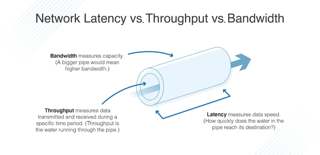
  - 대역폭이 클수록 더 많은 데이터를 동시에 전송할 수 있어 처리량이 많아진다.
  - 네트워크 용량이 전송 매체의 최대 대역폭에 도달하면 처리량이 해당 제한을 초과할 수 없다.
- 네트워크 처리 능력
  - 네트워크 디바이스에는 처리 성능을 향상시키는 특수 하드웨어 또는 소프트웨어 최적화가 있음 (ex. 전용 애플리케이션별 집접 회로 또는 소프트웨어 기반 패킷 처리 엔진)
  - 이러한 최적화를 통해 디바이스는 더 많은 양의 트래픽과 더 복잡한 패킷 처리 태스크를 처리할 수 있으므로 처리량이 향상됨
- 패킷 손실
  - 네트워크 정체, 하드웨어 결함 또는 잘못 구성된 네트워크 디바이스 등 다양한 이유로 발생
  - 패킷이 손실되면 다시 전송해야 하므로 처리량 감소
- 네트워크 토폴로지
  - 노드와 링크가 어떻게 배치되어 있는지에 대한 방식이자 연결 형태
  - 잘 설계된 네트워크 토폴로지는 데이터 전송을 위한 다중 경로를 제공하고 트래픽 병목 현상을 줄이며 처리량을 증가시킴

[참고 자료]

- https://aws.amazon.com/ko/compare/the-difference-between-throughput-and-latency/
- https://www.dnsstuff.com/latency-throughput-bandwidth

## 네트워크 병목현상은 무엇인가요?

- 병목 현상: 전체 시스템의 성능이나 용량이 하나의 구성 요소로 인해 제한을 받는 현상
- 서비스에서 이벤트를 열었을 때 트래픽이 많이 생기고 그 트래픽을 잘 관리하지 못하면 병목 현상이 생겨 사용자는 웹 사이트로 들어가지 못할 수 있음

## TCP/IP 가 무엇인가요? 각 계층에 대해서 설명할 수 있나요?

- TCP/IP: 인터넷과 이와 유사한 컴퓨터 네트워크 사이에서 정보를 주고받는 데 이용되는 통신 프로토콜의 모음
- 일반적으로 4개의 계층으로 구성

  1. 응용 계층

  - 응용 프로그램이 사용되는 프로토콜 계층
  - 웹 서비스, 이메일 등 서비스를 실질적으로 사람들에게 제공하는 층
  - 데이터 단위 - 메시지

  2. 전송 계층

  - 송신자와 수신자를 연결하는 통신 서비스를 제공
  - 애플리케이션과 인터넷 계층 사이의 데이터가 전달될 때 중계 역할
  - 데이터 단위 - 세그먼트

  3. 인터넷 계층

  - 네트워크 간의 데이터 패킷 전달을 담당
  - 데이터 단위 - 패킷

  4. 네트워크 인터페이스 계층

  - 물리적인 네트워크 연결을 담당
  - 데이터 단위 - 프래임

[참고 자료]

- https://nordvpn.com/ko/blog/tcp-ip-protocol/?srsltid=AfmBOoo1GrvmF3IAYiaFPDpm_1TwTroSqkjzHK94V6Q6umb6FicP43nd
- https://m.blog.naver.com/hai0416/221592953663

## 전송 계층의 대표적인 방식은 무엇이 있고 어떤 차이가 있나요? (키워드: TCP, UDP)

| 구분           | TCP            | UDP                |
| -------------- | -------------- | ------------------ |
| 연결 방식      | 연결형 서비스  | 비연결형 서비스    |
| 패킷 교환 방식 | 가상 회선 방식 | 데이터그램 방식    |
| 전송 순서      | 순서 보장      | 순서 바뀔 수 있음  |
| 수신 여부      | 확인           | 확인하지 않음      |
| 통신 방식      | 1:1 통신       | 1:1, 1:N, N:N 통신 |
| 신뢰성         | 높음           | 낮음               |
| 속도           | 느림           | 빠름               |

## 계층 간 데이터 송수신 과정에 대해 설명할 수 있나요? (키워드: 캡슐화, 비캡슐화)

- 캡슐화: 데이터가 하위 계층으로 내려가면서 각 계층에서 필요한 헤더 정보를 추가하여 최종적으로 물리적 매체를 통해 전송되는 과정
  1. 응용 계층
  - 사용자가 입력한 데이터가 응용 계층에서 생성됩니다. 예를 들어, 웹 브라우저에서 URL을 입력하면 HTTP 요청 메시지가 생성됩니다.
  2. 표현 계층
  - 데이터는 전송하기 적합한 형태로 변환됩니다. 암호화나 압축이 필요한 경우 이 계층에서 수행됩니다.
  3. 세션 계층
  - 세션 계층은 통신 세션을 관리합니다. 데이터가 오가는 연결을 설정하고 유지하며, 세션이 끝나면 종료합니다.
  4. 전송 계층
  - 데이터는 작은 데이터 패킷으로 나뉘고, 각 패킷에 전송 계층 헤더(TCP 또는 UDP 헤더)가 추가됩니다. 이 헤더에는 패킷 번호, 포트 번호, 오류 검출 정보 등이 포함됩니다.
  5. 네트워크 계층
  - 전송 계층에서 받은 데이터 패킷에 네트워크 계층 헤더(IP 헤더)가 추가됩니다. 이 헤더에는 발신지와 목적지의 IP 주소가 포함됩니다.
  6. 데이터 링크 계층
  - 네트워크 계층에서 받은 데이터에 MAC 주소와 같은 데이터 링크 계층 헤더가 추가됩니다. 프레임이라는 단위로 변환되며, 에러 검출 및 흐름 제어를 위한 정보도 포함됩니다.
  7. 물리 계층
  - 데이터 링크 계층에서 받은 프레임은 전기 신호나 무선 신호로 변환되어 물리적 매체(케이블, 무선 등)를 통해 전송됩니다.
- 역캡슐화: 캡슐화의 역순으로, 각 계층에서 헤더를 제거하고 상위 계층으로 전달되는 방식

  1. 물리 계층

  - 수신 측에서 신호를 받아들입니다. 신호는 데이터 링크 계층이 이해할 수 있는 비트 스트림으로 변환됩니다.

  2.  데이터 링크 계층

  - 물리 계층에서 받은 비트 스트림을 프레임으로 조립하고, 데이터 링크 계층 헤더를 제거한 후 네트워크 계층으로 전달합니다.

  3.  네트워크 계층

  - 데이터 링크 계층에서 받은 프레임에서 네트워크 계층 헤더(IP 헤더)를 제거하고, 나머지 데이터를 전송 계층으로 전달합니다.

  4.  전송 계층

  - 네트워크 계층에서 받은 데이터를 전송 계층 헤더(TCP/UDP 헤더)를 제거한 후 세션 계층으로 전달합니다. 이 과정에서 패킷이 올바른 순서로 재조립됩니다.

  5.  세션 계층

  - 세션 계층은 데이터의 세션을 관리하며, 나머지 데이터를 프레젠테이션 계층으로 전달합니다.

  6.  프레젠테이션 계층

  - 데이터는 필요한 경우 암호 해독이나 압축 해제 등을 거친 후 응용 계층으로 전달됩니다.

  7.  응용 계층

  - 최종적으로 사용자가 이해할 수 있는 데이터 형태로 변환되어 사용자에게 전달됩니다.

## 네트워크에서 PDU에 대해 알고 있나요?

- PDU(Protocol Data Unit): 네트워크의 어떠한 계층에서 계층으로 데이터가 전달될 때의 데이터 단위

|    계층     |                   명칭                    |
| :---------: | :---------------------------------------: |
|  응용 계층  |                  메시지                   |
|  전송 계층  |      세그먼트(TCP), 데이터그램(UDP)       |
| 인터넷 계층 |                   패킷                    |
|  링크 계층  | 프레임(데이터 링크 계층), 비트(물리 계층) |

## 로드밸런서란 무엇인가요?

- 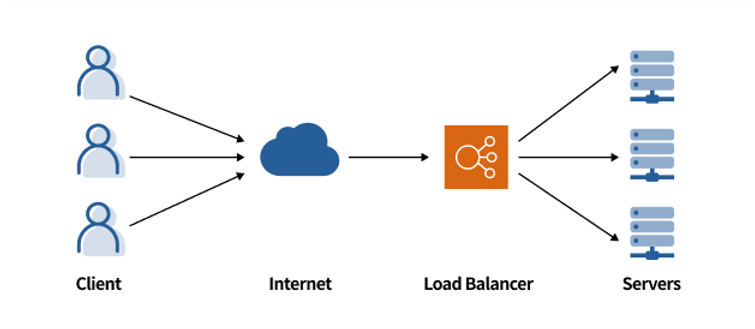
- 서버 부하를 분산하는 기기
- 하나의 서버에 트래픽이 몰려 부하를 감당하지 못하고 서버가 다운되는 문제 방지 가능
- 스케일업, 스케일아웃 방식이 있음
  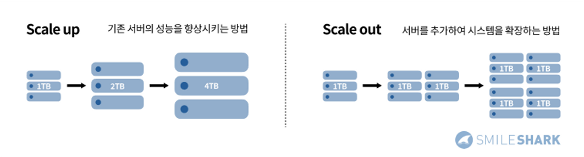
  - 스케일업 - 기존 서버의 성능을 향상시키는 방법
  - 스케일아웃 - 서버를 추가하여 시스템을 확장하는 방법

### 로드밸런싱이란?

- 여러 서버나 컴퓨터 자원에 작업을 고르게 분산하여 처리하는 것
- 이점
  - 애플리케이션 가용성
    - 서버 문제를 자동 감지, 트래픽을 사용 가능한 서버로 리다이렉션 -> 가동 중지 없이 다음 태스크 수행 가능
  - 애플리케이션 확장성
    - 한 서버에 트래픽 병목 현상 방지, 필요한 경우 다른 서버를 추가하거나 제거할 수 있도록 트래픽 예측
  - 애플리케이션 보안
    - 공격자의 수백만 개 동시 요청으로 서버를 가득 채우는 DDoS 공격 처리에 유용
  - 애플리케이션 성능
    - 네트워크 지연 시간을 줄여 애플리케이션 성능을 향상시킴

> 쿠버네티스 기능 중 하나로만 알고 있었는데, 범용적으로 쓰이는 개념이었다..!

[참고 자료]

- https://www.smileshark.kr/post/what-is-a-load-balancer-a-comprehensive-guide-to-aws-load-balancer
- (더알아보기) https://aws.amazon.com/ko/what-is/load-balancing/

## ARP란 무엇인가요?

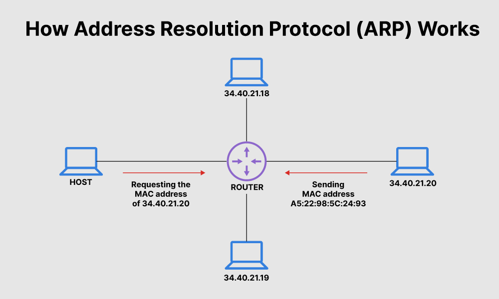

- Address Resolution Protocol
- 동적 IP 주소를 LAN에서 MAC 주소(물리적 주소)에 연결하는 프로토콜
- 네트워크에 연결된 호스트 또는 컴퓨터의 소프트웨어 주소(IP 주소)를 하드웨어 주소(MAC 주소)로 변환해야 하므로 ARP가 필요합니다. LAN은 해당 네트워크의 엔드포인트와 라우터를 포함하여 다양한 장치의 IP 주소를 MAC 주소에 매핑하는 테이블 또는 디렉토리를 유지합니다.
- 유형
  - Proxy ARP
  - Gratuitous ARP
  - Reverse ARP (RARP)
  - Inverse ARP (IARP)

[참고 자료]

- https://www.fortinet.com/resources/cyberglossary/what-is-arp

## MAC 주소란 무엇인가요?

- Media Access Control
- 48비트로 구성된 하드웨어 고유의 주소로, 네트워크 인터페이스 계층(/데이트 링크 계층)에서 사용
- 두 개의 물리적으로 연결된 장치 간에 연결을 설정하고 종료하여 데이터 전송이 이루어질 수 있도록 함
- MAC 동작
  > 데이터가 네트워크를 통해 전송될 때는 패킷으로 나뉘어 개별적으로 전송됩니다. 각 패킷에는 발신자와 수신자의 MAC 주소가 모두 포함되어 있어 올바른 방향으로 전송될 수 있습니다. 패킷이 목적지에 도달하면 수신 장치는 목적지 MAC 주소를 확인하여 해당 패킷이 자신을 위한 것인지 확인합니다.\_레노버

[참고 자료]

- https://www.lenovo.com/kr/ko/glossary/what-is-mac/?orgRef=https%253A%252F%252Fwww.google.com%252F&srsltid=AfmBOoq_TYCyq1j6ue-vH8kWmY7mnO-JUD68Cyi7V5DKWZuCxRB4xr7b

## NAT란 무엇인가요?

- Network Address Translation
- IP패킷의 TCP/UDP 포트 숫자와 소스 및 목적지의 IP 주소 등을 재기록하면서 라우터를 통해 네트워크 트래픽을 주고 받는 기술
- 사설 네트워크(Private Network)에 속한 여러 개의 호스트가 하나의 공인 IP 주소를 사용하여 인터넷에 접속하기 위해 사용

[참고 자료]

- (더알아보기) https://inpa.tistory.com/entry/WEB-%F0%9F%8C%90-NAT-%EB%9E%80-%EB%AC%B4%EC%97%87%EC%9D%B8%EA%B0%80

# HTTP

## HTTP란 뭔가요?

- HyperText Transfer Protocol
- 인터넷상에서 데이터를 전송하기 위한 클라이언트-서버 구조의 통신 프로토콜
- TCP/IP 4계층에서 응용 계층에 속함

## HTTP 프로토콜의 가장 큰 특징은 뭔가요?

- 비연결성 : 클라이언트에서 요청을 보낸 후 서버로부터 응답을 받으면 연결을 끊는 것
  - 불특정 다수를 대상으로 하는 서비스에 유리
  - 장점
    - 연결을 유지하지 않음으로써 자원을 아낄 수 있음
  - 단점
    - 연결을 유지하지 않아 서버가 클라이언트를 기억할 수 없음
    - 동일한 클라이언트에서 연속적으로 요청이 오면 연결과 연결 해제 과정을 반복하게 되어 자원을 낭비하게 됨
      -> 단점 보완을 위해 일정 시간 동안 연결을 유지할 수 있도록 **HTTP Keep Alive** 사용
- 무상태 : 서버에서 클라이언트의 상태를 저장하지 않는 것
  - 클라이언트가 이전에 요청한 사항을 서버에 저장하지 않기 때문에
    클라이언트는 요청에 필요한 데이터를 모두 가지고 있어야 함. -> 쿠키
    또는 서버가 클라이언트로부터 받은 요청 사항을 모두 저장해야 함 -> 세션
  - 장점
    - 서버 확장성이 높음 (클라이언트의 요청에 응답하는 서버가 바뀌어도 되기 때문)

## URL은 뭔가요?

- Uniform Resource Locator
- 인터넷에서 자원의 위치를 알 수 있는 규약
- 웹 사이트 주소와 인터넷의 모든 자원을 나타낼 수 있다.

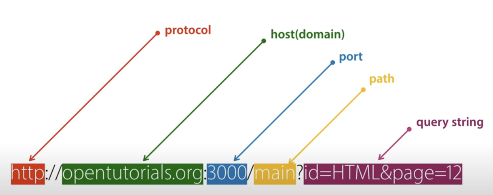

### URL vs URI

- URI(Uniform Resource Identifier)

  - 인터넷에 있는 자원을 나타내는 주소
  - 인터넷에서 요구하는 기본 조건으로 인터넷 프로토콜에 항상 붙어 다닌다.
  - 하위 개념으로 URL, URN이 있다.

[참고 자료]

- (더알아보기) https://inpa.tistory.com/entry/WEB-%F0%9F%8C%90-URL-URI-%EC%B0%A8%EC%9D%B4

## HTTP/1.0 과 HTTP/1.1의 차이는 뭔가요? / HTTP/1.1 과 HTTP/2.0의 차이는 뭔가요?

- HTTP/1.0

  - 커넥션 하나당 하나의 요청을 처리하도록 설계
  - 서버로부터 파일을 가져올 때마다 TCP의 3-way 핸드셰이크를 계속해서 열어야 하기 때문에 RTT가 증가하는 단점
    \*RTT: 패킷이 목적지에 도달하고 나서 다시 출발지로 돌아오기까지 걸리는 시간, 패킷 왕복 시간
    > **RTT 증가를 해결하기 위한 방법**
    >
    > - 이미지 스플리팅 : 많은 이미지가 합쳐 있는 하나의 이미지를 다운로드받고, 이를 기반으로 background-image의 position을 이용해 이미지를 표기하는 방법
    > - 코드 압축 : 개행 문자, 빈칸을 없애서 코드 크기 최소화하는 방법
    > - 이미지 Base64 인코딩 : 이미지 파일을 64진법으로 이루어진 문자열로 인코딩하는 방법
        - 장점: 서버와의 연결을 열고 이미지에 대해 서버에 HTTP 요청을 할 필요가 없다.
        - 단접: Base64 문자열로 변환할 경우 37% 정도 크기가 더 커진다.

- HTTP/1.1

  - Persistent Connection
    : 지정한 timeout 동안 커넥션을 닫지 않는 방식
    - 매번 TCP 연결을 하는 것이 아니라 한 번 TCP 초기화를 한 이후에 keep-alive라는 옵션으로 여러 개의 파일을 송수신할 수 있게 바뀜 (HTTP/1.0에서도 keep-alive가 있었지만 표준화 X)
    - 문서 안에 포함된 다수의 리소스(이미지, css 파일, script 파일)를 처리하려면 요청할 리소스 개수에 비례해서 대기 시간이 길어지는 단점
  - 파이프라이닝
    : 하나의 커넥션에서 응답을 기다리지 않고 순차적인 여러 요청을 연속적으로 보내 그 순서에 맞춰 응답을 받는 방식 (지연시간 줄이기 가능)
    - 문제
      - HOL Blocking(Head Of Line Blocking) : 네트워크에서 같은 큐에 있는 패킷이 그 첫 번째 패킷에 의해 지연될 때 발생하는 성능 저하 현상
      - Header 구조의 중복

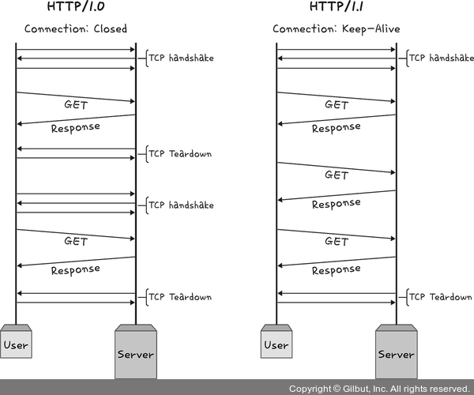

- HTTP/2.0
  - 멀티플렉싱
    : 여러 개의 스트림을 사용하여 송수신
    - 애플리케이션에서 받아온 메시지를 독립된 프레임으로 조각내어 서로 송수신한 이후 다시 조립하며 데이터를 주고받음
      -> 특정 스트림의 패킷이 손실되었다고 하더라도 해당 스트림에만 영향을 미치고 나머지 스트림은 멀쩡하게 동작할 수 있음
      -> 단일 연결을 사용하여 병렬로 여러 요청을 받을 수 있고 응답을 줄 수 있음
      -> HOL Blocking을 해결 가능
  - 헤더 압축
    - 허프만 코딩 압축 알고리즘을 사용하는 HPACK 압축 형식 \*허프만 코딩: 문자열을 문자 단위로 쪼개 빈도수를 세어 빈도가 높은 정보는 적은 비트 수를 사용하여 표현하고, 빈도가 낮은 정보는 비트 수를 많이 사용하여 표현해서 전체 데이터의 표현에 필요한 비트양을 줄이는 원리
  - 서버 푸시
    - 클라이언트 요청 없이 서버가 바로 리소스를 푸시
      -> html에는 css나 js 파일이 포함되기 마련인데 html을 읽으면서 그 안에 들어 있던 css 파일을 서버에서 푸시하여 클라이언트에 먼저 줄 수 있음
  - 요청의 우선순위 처리

[참고 자료]

- https://thebook.io/080326/0122/

## HTTPS는 HTTP랑 뭐가 다른가요?

- HTTP와 달리 HTTPS에는 보안 계층의 암호화 프로토콜인 SSL/TLS가 있어서 전송하려는 데이터를 암호화해 보호 가능
- HTTP는 80번 통신 포트 사용, HTTPS는 443번 통신 포트 사용

### HTTPS란?

: 애플리케이션 계층과 전송 계층 사이에 신뢰 계층인 SSL/TLS 계층을 넣은 신뢰할 수 있는 HTTP 요청

### SSL/TLS

: 전송 계층에서 보안을 제공하는 프로토콜

- SSL(Secure Socket Layer)은 SSL 1.0부터 시작해서 SSL 2.0, SSL 3.0,
  TLS(Transport Layer Security Protocol) 1.0, TLS 1.3까지 버전이 올라가며
  마지막으로 TLS로 명칭이 변경되었으나, 보통 이를 합쳐 SSL/TLS로 많이 부름
- 보안 세션을 기반으로 데이터를 암호화하며 보안 세션이 만들어질 때 인증 메커니즘, 키 교환 암호화 알고리즘, 해싱 알고리즘이 사용됨

[참고 자료]

- https://thebook.io/080326/0132/

## 심화) 공개키 (비대칭키) 방식이 뭔가요?

### 대칭 키 암호화 방식

- 데이터의 암호화와 복호화에 모두 같은 키인 대칭 키를 이용하는 방식
- 수신자가 가진 키를 송신자에게 준다. (수신자가 같더라도 송신자가 다르면 이용하는 키도 다르다.)
  -> 송신자는 받은 키로 데이터를 암호화한 후 수신자에게 보낸다.
  -> 수신자는 동일한 키로 데이터를 복호화한다.
- 대칭 키 유출 주의

### 공개 키 암호화 방식

- 데이터의 암호화와 복호화를 다른 키로 하는 방식
- 데이터를 암호화할 때는 공개 키를, 데이터를 복호화할 때는 비밀 키 이용
- 수신자는 공개 키를 송신자에게 준다. (송신자가 달라도 공개 키는 같다.)
  -> 송신자는 수신자에게 받은 키로 데이터를 암호화한다.
  -> 수신자는 비밀 키로 송신자에게 받은 데이터를 복호화한다.
- 비밀 키가 있어야만 데이터를 복호화할 수 있어서 공개 키 유출을 염려하지 않아도 된다.

### SSL/TLS 암호화 방식

- 대칭 키 암호화 방식과 공개 키 암호화 방식 모두 사용됨

  - 실제 데이터 암호화 및 복호화 -> 대칭키
  - 대칭 키 보호 -> 공개 키 암호화 방식 사용

# 운영체제

## 운영체제란 무엇인가요?

- 하드웨어 위에 설치되어 하드웨어 계층과 다른 소프트웨어 계층을 연결하는 소프트웨어 계층
- ex. 윈도우, 맥OS, 리눅스, 유닉스

## 운영체제는 어떤 역할을 하나요?

- 컴퓨터 시스템 자원 관리
- 사용자가 컴퓨터를 사용할 수 있는 환경 제공

### 운영체제의 목적/성능 평가 기준

- 처리 능력(throughput) 향상
  - 자원 관리를 통해 일정 시간 내에 시스템이 처리하는 일의 양을 향상
- 반환 시간(turnaround time) 단축
  - 사용자가 시스템에 요청한 작업을 완료할 때까지 소요되는 시간 단축
- 사용 가능도(availability) 향상
  - 사용자가 컴퓨터를 사용해야 할 때 자원을 즉시 사용할 수 있게 함
- 신뢰도(reliability) 향상
  - 입력 값에 대한 정확한 결과 값을 줄 수 있도록 신뢰도 향상

## 운영체제는 어떤 구조로 이루어져 있나요?

- 인터페이스(GUI/CLI)
  - 커널에 사용자 명령을 전달하고 실행 결과를 사용자에게 알려주는 역할
- 시스템 콜
  - 사용자 모드에서 커널 모드에 접근해 필요한 기능을 수행할 수 있게 하는 시스템 함수
  - 역할
    - 프로세스 제어
    - 파일 조작
    - 장치 관리
    - 데이터의 유지 보수, 통신, 보호
- 커널

  - OS의 핵심 요소
  - 역할
    - 컴퓨터 하드웨어와 프로세스의 보안
    - 자원 관리
      - CPU 스케줄링
      - 메모리 관리
      - 입출력 관리
      - 파일 시스템 관리
    - 하드웨어 추상화

- 드라이버
  - 하드웨어를 제어하기 위한 소프트웨어로, 커널과 하드웨어의 인터페이스를 담당

### 커널 모드 vs 사용자 모드

> 운영체제는 커널에서 관리하는 중요 자원에 사용자가 쉽게 접근하지 못하도록 커널 모드와 사용자 모드로 모드를 나눈다.

- 커널 모드
  - 하드웨어에 직접 접근해 메모리, CPU와 같은 자원을 사용할 수 있다.
- 사용자 모드
  - 커널 모드의 자원에 접근할 수 없게 제한을 둔다.

## 컴퓨터는 어떤 요소로 이루어져 있나요?

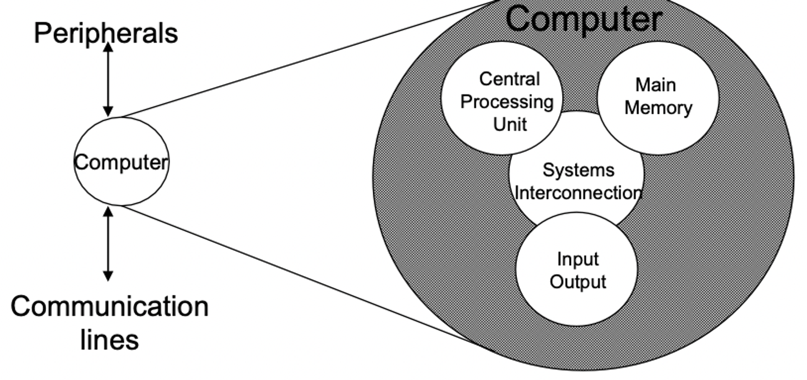

- CPU
  : 컴퓨터의 동작을 제어(현재 상태값을 저장, 정보 해석)하고, 데이터를 처리하는 역할
  - 프로세서라고도 부름
- Main memory
  : CPU가 접근하여 처리할 수 있는 기억 장치
  - 데이터와 명령어 저장
  - 흔히 RAM(Random Access Memory)
- I/O
  : 키보드, 마우스, 모니터 등 컴퓨터가 처리하기 위한 데이터를 읽고 그 결과물을 출력하는 장치
- System Interconnection
  : CPU, 메인 메모리, I/O 장치 간의 통신 메커니즘
  - ex. 시스템 버스

[참고 자료]

- https://jaehyeon48.github.io/computer-architecture/computer-architecture-intro/
- https://hongong.hanbit.co.kr/%EC%BB%B4%ED%93%A8%ED%84%B0%EC%9D%98-4%EA%B0%80%EC%A7%80-%ED%95%B5%EC%8B%AC-%EB%B6%80%ED%92%88cpu-%EB%A9%94%EB%AA%A8%EB%A6%AC-%EB%B3%B4%EC%A1%B0%EA%B8%B0%EC%96%B5%EC%9E%A5/

## CPU는 어떤 요소로 이루어져 있나요?

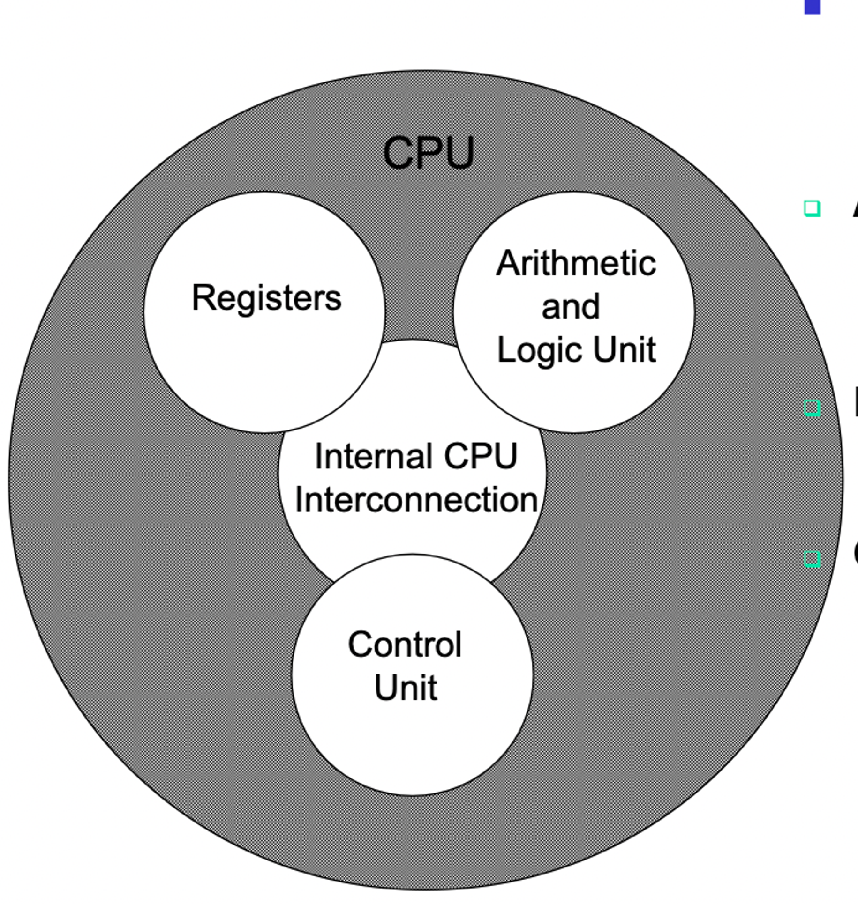

- Control Unit - CPU의 동작을 제어

  - 현재 상태값 저장
  - 외부의 어떤 정보 해석

- ALU(Arithmetic Logic Unit) - 실제 산술연산, 논리연산 수행
- Registers - 데이터 저장 (CPU 내의 데이터를 한 클럭만에 읽고 씀)
- CPU Interconnection - 제어 장치, ALU, 레지스터 간의 통신 메커니즘

[참고 자료]

- https://taegyunwoo.github.io/comput-struct/ComputerStructure_ControlUnit

## CPU는 어떻게 동작하나요?

[CPU 4가지 기능]
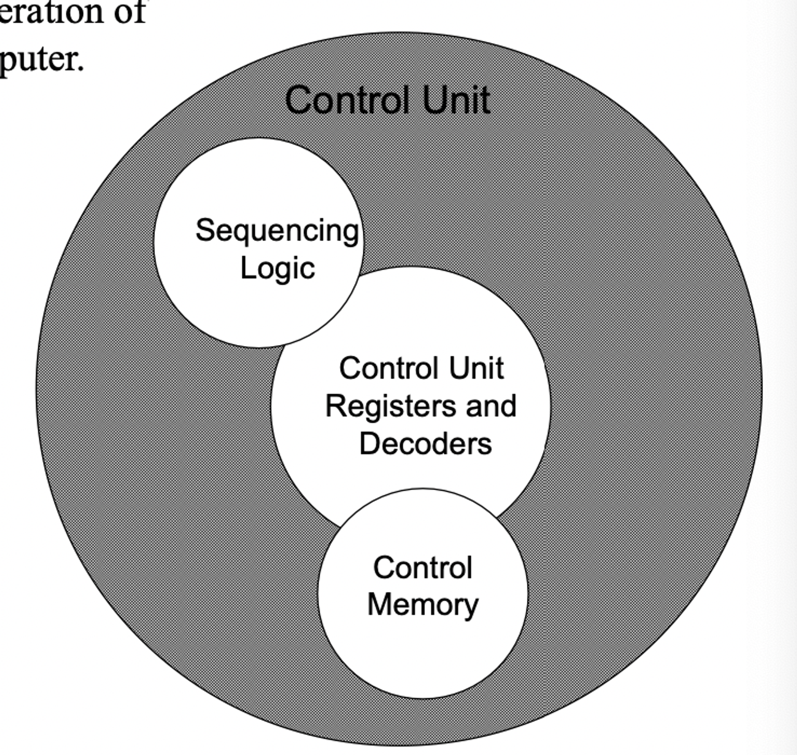

- Data processing - 데이터 처리
- Data storage - 데이터 저장
- Data movement - 데이터 이동
- Control - 제어

| Movement                                                                                                              | Storage                                                                                   | Procession from/to storage                                                 | Procession from storage to i/o                        |
| --------------------------------------------------------------------------------------------------------------------- | ----------------------------------------------------------------------------------------- | -------------------------------------------------------------------------- | ----------------------------------------------------- |
| 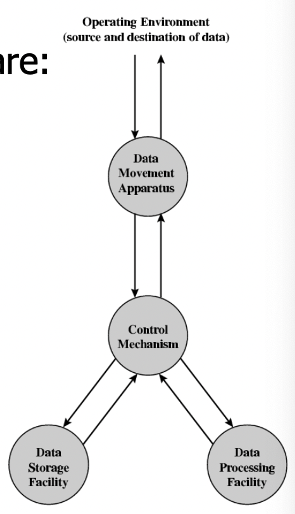                                                                                      | 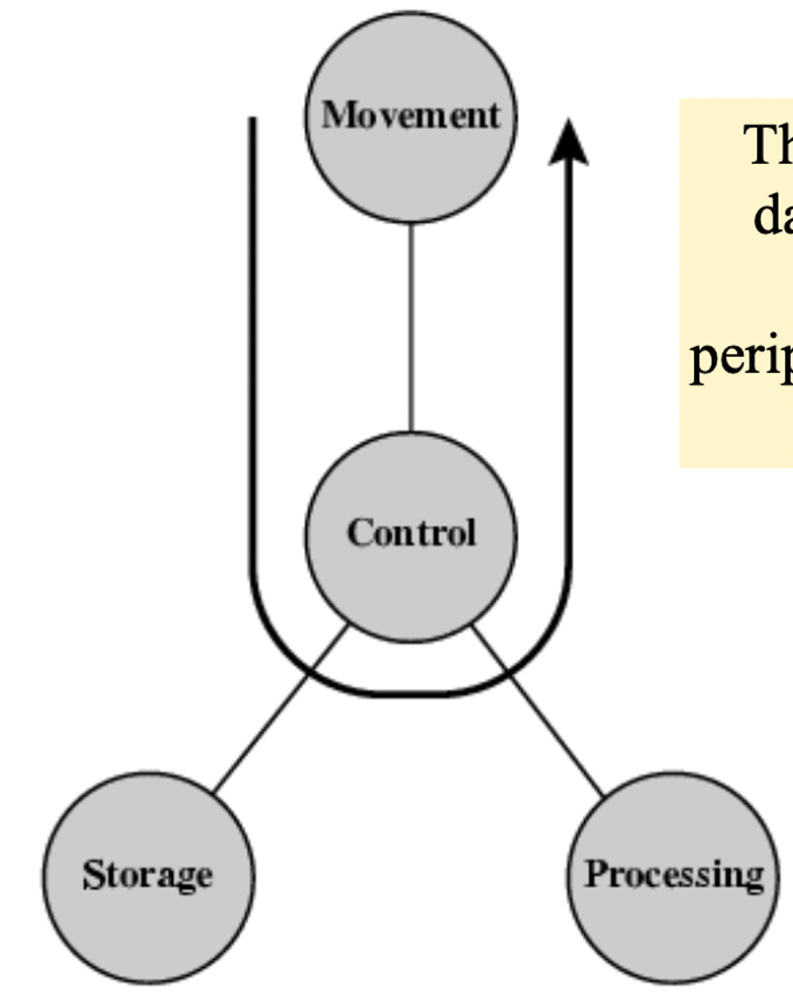                                                         | 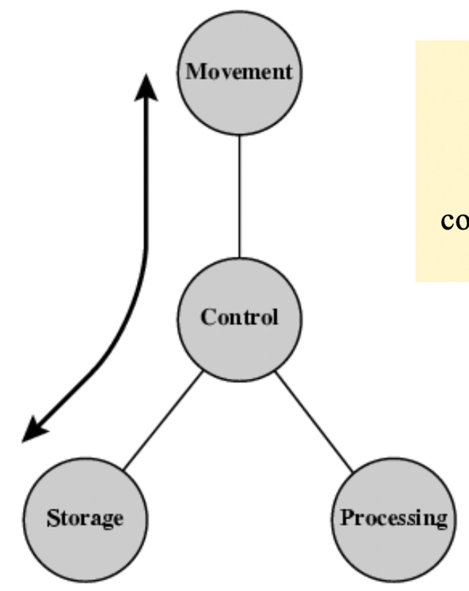                                          | 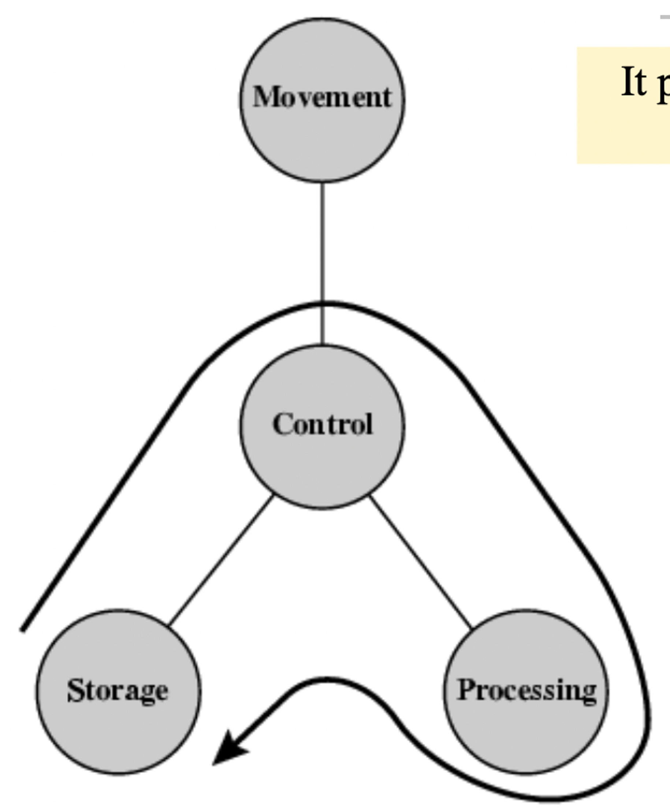                     |
| 적절한 control을 통해서 데이터가 어떤 디바이스에서 또다른 디바이스 어떤 컴포넌트에서 또다른 컴포넌트로 이동이 되는 것 | 입출력으로부터 데이터를 변환해서 다시 저장하거나 저장된 데이터를 변환해서 다시 출력하거나 | storage에 있던 데이터를 적절히 control을 통해 읽어서 처리한 다음 다시 저장 | 특정 데이터가 movement에 의해서 storage에 저장이 된다 |

[참고 자료]

- https://jagdishkapadnis.wordpress.com/wp-content/uploads/2018/08/chapter1-introduction.pdf

## 메모리란 무엇인가요?

: 데이터를 저장하기 위한 기억 장치

- 주 기억장치 - 휘발성
  - 메인 메모리(RAM)
- 보조 기억장치 - 비휘발성
  - SSD, HDD

## 메모리는 어떤 계층 구조로 이루어져 있나요?

|   메모리 계층 구조    |
| :-------------------: |
|    레지스터 in CPU    |
|      캐시 in CPU      |
|    주기억장치(RAM)    |
| 보조기억장치(SSD/HDD) |

- 레지스터 : CPU가 사용자 요청을 처리하는 데 필요한 데이터를 임시로 저장하는 기억장치
  - CPU 내부에 존재, 접근 속도 빠름
- 캐시 메모리 : CPU와 RAM 속도 차이를 해결하기 위한 기억장치
  - CPU 내부에 위치, 접근 속도가 레지스터 다음으로 빠름
- RAM : 컴퓨터에서 프로그램을 실행할 때 필요한 정보 저장
  - CPU에서 접근 속도가 하드 디스크보다 빠르고, 휘발성 기억장치
  - 보통 메모리라고 할 때 RAM을 의미하는 경우가 많음
- 하드 디스크 : 사용자가 필요한 데이터와 프로그램을 저장
  - 비휘발성 기억 장치

## 메모리는 어떤 방식으로 데이터를 관리하나요?

> 프로그램 실행
> -> OS가 디스크에 있는 프로그램을 메모리로 로드(load)
>
> - 메모리에 로드한 프로그램을 프로세스라고 하며, CPU가 처리

### 메모리 관리 전략

> 다수의 프로세스를 실행하려면 메모리 공간에 많은 프로세스를 로드할 수 있어야 함

### 논리 메모리와 물리 메모리

- 논리(가상) 메모리 - 프로세스가 보는 메모리 영역
- 물리 메모리 - 실제로 사용되는 메모리 영역(RAM)

#### 연속적 메모리 할당

: 멀티 프로세스 환경에서 여러 프로세스를 메모리에 연속적으로 로드하는 방법

- 고정 분할 방식 : 메모리 영역을 분할한 뒤 각 영역에 프로세스를 할당하는 방식
  - 👎
    - 메모리에 올릴 수 있는 프로세스 수와 각 프로세스 크기가 제한됨
    - 단편화(fragmentation) 문제 발생 가능
      - 외부 단편화 - 메모리 공간을 합치면 프로세스에 공간을 할당할 수 있지만, 고정 분할 때문에 할당하지 못하는 것 -> 메모리 압축
      - 내부 단편화 - 분할된 크기보다 작은 프로세스가 할당되어 메모리 공간이 남는 것
- 가변 분할 방식 : 할당할 프로세스의 크기에 따라 메모리 공간을 분할하는 방식
  - 최초 적합 - 비어있는 공간 찾아 프로세스 로드
  - 최적 적합 - 프로세스 크기 이상의 가용 메모리 공간 중 가장 작은 공간에 프로세스 할당 (가용 메모리 공간 모두 탐색해야 함)
  - 최악 적합 - 프로세스 큰 가용 메모리 공간 중에서 가장 큰 공간에 프로세스를 할당 (가용 메모리 공간 모두 탐색해야 함)

#### 비연속적 메모리 할당

: 프로세스의 메모리 영역을 나눠서 메모리 공간에 저장하는 방법

- 페이징 : 프로세스의 메모리 영역과 물리 메모리 영역을 일정 크기로 분할하는 방식
  - 프로세스의 메모리 영역을 페이지로, 물리 메모리 영역을 프레임으로 나눔
  - 내부 단편화 문제 발생 가능
- 세그먼테이션 : 프로세스를 논리적 단위로 분할하는 방식
  - 데이터를 보호하기 쉬움
  - 스택 세그먼트 영역에서 스택 오버플로 발생 가능

#### 가상 메모리

- 프로세스의 일부만 메모리에 로드하고, 나머지는 디스크에 둔 상태로 프로세스를 실행하는 방식
- 👍

  - 프로그램이 메모리 크기에 대한 제약을 덜 받을 수 있음
  - 동시에 많은 프로그램을 실행하므로 CPU 이용률과 처리율을 높일 수 있음
  - 필요한 영역만 메모리에 로드해 스와핑 횟수를 줄여서 프로그램 실행 속도를 높일 수 있다.

- 요구 페이징: 필요한 페이지만 메모리에 로드, 페이지 폴트 발생 가능
- 스레싱: 가상 메모리 환경에서 다중 프로그래밍 정도가 높아지면서 페이지 폴트가 빈번히 발생해 CPU 이용률이 오히려 낮아지는 증상

# 프로세스와 스레드

## 프로세스가 뭔가요?

- 컴퓨터에서 '실행 중인' 하나의 프로그램
- 메모리에 로드한 프로그램

## 스레드가 뭔가요?

- 프로세스에서 실제로 실행되는 흐름의 단위
- 프로세스의 메모리 공간 이용
- 스택 영역을 할당 박고, 그 외 영역은 다른 스레드와 공유

### 스레드가 스택 영역을 제외한 영역을 다른 스레드와 공유하는 이유

- 스택이 독립적인 이유
  - 각 스레드의 지역 변수와 함수 호출 스택을 보관하기 위해
  - 스택 영역이 공유되면 스레드 간 스택 프레임이 섞이게 되어 문제 발생 가능
- 그 외 공유하는 이유
  - 메모리 공간 절약
  - 데이터 공유 용이성
  - 효율적인 자원 활용
  - 응답성 향상

## 프로세스와 스레드는 어떤 차이가 있나요?

| 프로세스                 | 스레드                                            |
| ------------------------ | ------------------------------------------------- |
| 실행중인 하나의 프로그램 | 프로세스 내에서 실행되는 흐름의 단위              |
| 독립적인 메모리 영역     | 스택 영역만 독립적, 그 외 영역 다른 스레드와 공유 |

## 프로그램의 컴파일 과정에 대해 설명해줄 수 있나요?

> c언어 기준

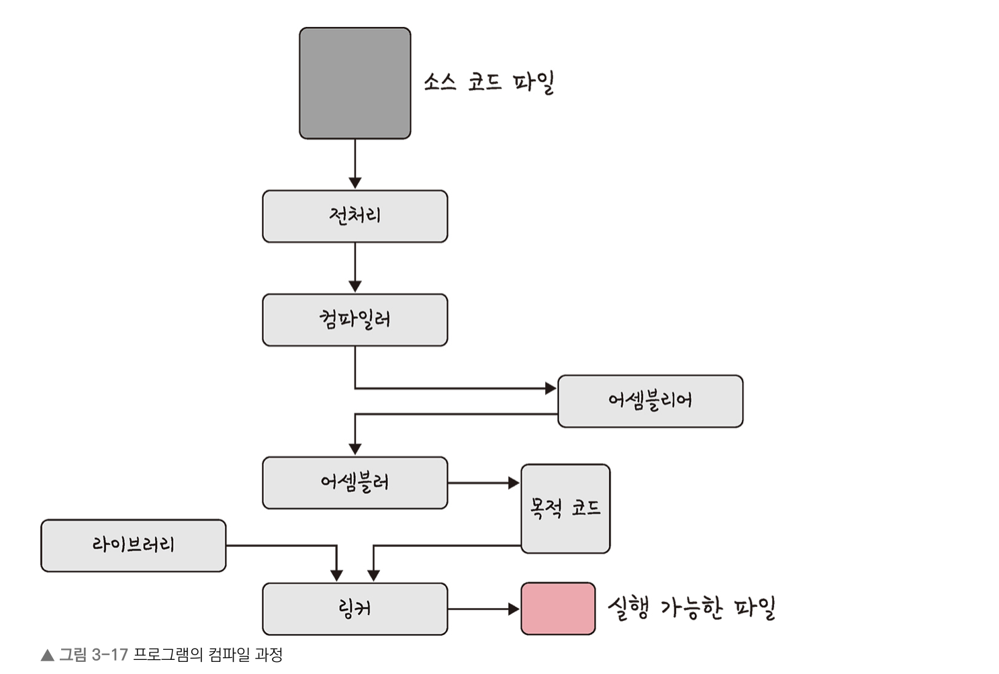

- 전처리 : 소스 코드의 주석을 제거하고 #include 등 헤더 파일을 병합하여 매크로를 치환
- 컴파일러 : 오류 처리, 코드 최적화 작업을 하며 어셈블리어로 변환
- 어셈블러 : 어셈블리어는 목적 코드(object code)로 변환, 확장자는 운영체제마다 다름 (EX. 리눅스 : .o)
- 링커 : 프로그램 내에 있는 라이브러리 함수 또는 다른 파일들과 목적 코드를 결합하여 실행 파일 만듬(확장자는 .exe 혹은 .out)

## 프로세스는 어떤 상태 값을 가지고 있나요?

생성 : 프로세스가 PCB를 가지고 있지만 OS로부터 승인받기 전
준비 : OS로부터 승인받은 후 준비 큐에서 CPU 할당을 기다림
실행 : 프로세스가 CPU를 받아 실행
대기 : 프로세스가 입출력이나 이벤트 발생을 기다려야 해서 CPU 사용을 멈추고 기다림
종료 : 프로세스가 실행을 종료함

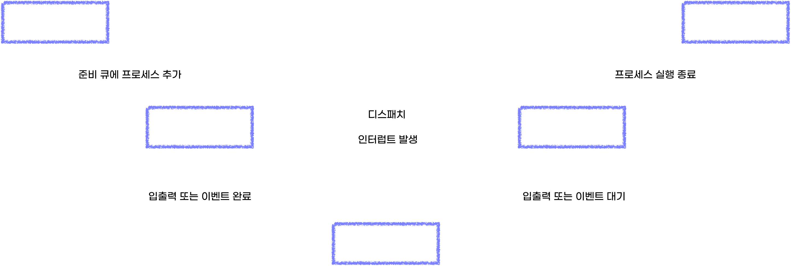

## 프로세스는 어떤 구조로 이루어져 있나요? (스택, 힙, 데이터 영역, 코드 영역)

> 프로세스는 OS로부터 독립된 메모리 영역 할당 받음
> 다른 프로세스 메모리 영역에 접근 X

(높은 주소 값)

- 스택 - 지역 변수, 함수의 매개변수 등
  - 높은 주소 값 -> 낮은 주소값으로 메모리 할당
  - 컴파일 때 영역 크기 결정
- 힙 - 사용자 동적 할당
  - 낮은 주소 값 -> 높은 주소 값으로 메모리 할당
  - 런타임에 영역 크기 결정
- 데이터 - 전역 변수, 정적 변수, 배열, 구조체 등
  - BSS 영역 - 초기화하지 않은 변수
  - 데이터 영역 - 초기화한 변수
- 코드(텍스트) - 실행할 코드(기계어)

(낮은 주소 값)

## PCB는 무엇인가요? 어떤 용도로 사용되나요? (메타 데이터)

: 프로세스 제어 블록

- OS가 프로세스를 제어하기 위해 프로세스 정보를 저장하는 구조체

| PCB 저장 정보  |
| -------------- |
| 포인터         |
| 프로세스 상태  |
| PID            |
| PC             |
| 레지스터       |
| 메모리 제한    |
| 열린 파일 목록 |

# 싱글 스레드와 멀티 스레드

### 싱글 스레드란?

- 한 프로세스에 하나의 스레드를 가지는 것
- 자바스크립트는 싱글 스레드 기반 프로그래밍 언어 (이벤트 루프로 비동기 작업 처리)

### 멀티 스레드란?

- 스레드를 여러 개 생성해 스레드들이 각자 다른 작업을 처리하는 것
- 자바스트립트에서는 웹 워커(브라우저), worker_threads 모듈(Node.js)을 사용하여 멀티 스레드 방식으로 작업 처리 가능

## 싱글 스레드 장점

- 단순성: 코드가 단순하고, 동기식으로 실행되어 디버깅이 용이
- 자원 관리 효율성: 메모리와 CPU 자원을 적게 사용
- 상태 관리 용이: 여러 스레드 간의 상태 공유 문제를 피할 수 있음

## 싱글 스레드 단점

- 비동기 처리의 필요: 긴 작업이 있을 경우 전체 프로그램이 멈추는 현상이 발생 가능
- 성능 한계: CPU 코어를 활용하지 못해 성능 제한적

## 멀티 스레드 장점

- 성능 향상: 여러 작업을 동시에 처리할 수 있어 성능 향상
- 응답성 개선: UI가 차단되지 않고 부드럽게 작동

## 멀티 스레드 단점

- 복잡성: 스레드 간의 동기화와 상태 관리가 복잡해질 수 있음
- 자원 소모: 여러 스레드를 생성하고 관리하는 데 더 많은 시스템 자원이 필요

# 공유 자원 임계 영역 교착 상태

## 공유 자원

- 시스템 안에서 각 프로세스, 스레드가 함께 접근할 수 있는 메모리, 파일, 데이터 등의 자원이나 변수

## 임계 영역

= 공유 자원애 접근할 수 있고, 접근 순서에 따라 결과가 달라지는 코드 영역

### 경쟁 상태란?

- 공유 자원에 동시에 접근해 경쟁하는 상태

### 프로세스 동기화

- 임계 영역에서 경쟁 상태가 발생하는 것 방지
- 프로세스 동기화 조건
  - 상호배제 기법 : 어떤 프로세스가 임계 영역을 실행 중일 때 다른 프로세스가 임계 영역에 접근할 수 없다.
    - 뮤텍스
    - 세마포어
  - 진행 : 임계 영역을 실행 중인 프로세스가 없을 때, 다른 프로세스가 임계 영역을 실행한다.
  - 한정된 대기 : 임계 영역에 접근을 요청했을 때 무한한 시간을 기다리지 않는다.

## 뮤텍스

- 락을 가진 프로세스만이 공유 자원에 접근할 수 있게 하는 방법
- ex. 열쇠(락)가 하나뿐인 화장실(공유지원)을 사용자(프로세스/스레드)가 이용

### 스핀락

- 락을 얻기 위해 (임계 영역에 접근하지 못한) 프로세스가 반복문을 돌면서 기다리는 것

## 세마포어

- 공유 자원에 접근할 수 있는 프로세스의 수를 정해 접근을 제어하는 방법
- ex. 화장실 3개, 열쇠 3개

## 교착 상태

- 2개 이상의 프로세스가 각각 자원을 가지고 있으면서 서로의 자원을 요구하며 기다리는 상태

### 교착 상태 발생 필요 충분 조건

- 상호배제 - 하나의 공유 자원에 하나의 프로세스만 접근 가능
- 점유와 대기 - 프로세스가 최초 하나의 자원을 점유하고 있는 상태에서 추가로 다른 프로세스에서 사용 중인 자원을 점유하기 위해 대기
- 비선점 - 다른 프로세스에 할당된 자원 뺏을 수 없음
- 환형 대기 - 프로세스가 자신의 자원을 점유하면서 앞이나 뒤에 있는 프로세스의 자원 요구

### 교착 상태를 막으려면

> 4가지 필요 충분 조건 중 한 가지 제거

- 상호 배제 부정 - 여러 프로세스가 동시에 하나의 공유 자원 사용 가능
- 점유와 대기 부정 - 프로세스가 실행되기 전에 필요한 모든 자원 할당함으로써 프로세스 대기 없앰 or 프로세스가 자원을 점유하기 않은 상태에서만 자원을 요구
- 비선점 부정 - 자원을 점유한 프로세스가 다른 자원을 요구할 때 점유한 자원을 반납하게 함
- 환형 대기 부정 - 자원을 선형 순서로 정렬해 고유 번호 할당, 각 프로세스에서 요구할 수 있는 번호의 방향을 정햇 ㅓ한 쪽 방향으로만 자원 요구

# 쿠키 세션

## 쿠키, 세션을 왜 쓰나요?

- HTTP는 무상태의 특성을 가짐
- 무상태 : 서버에서 클라이언트의 상태를 저장하지 않는 것
- 클라이언트가 이전에 요청한 사항을 서버에 저장하지 않기 때문에,
  클라이언트는 요청에 필요한 데이터를 모두 가지고 있어야 함. -> **쿠키**
  또는 서버가 클라이언트로부터 받은 요청 사항을 모두 저장해야 함 -> **세션**

## 쿠키가 뭔가요? 

- 클라이언트의 로컬 웹 브라우저에 저장하는 (4kb 이하) 데이터 파일
- 키와 값 저장
- 만료 기간 설정 가능
- 인증과 세션 관리 등에 사용
- ex. 웹 사이트의 로그인 정보, 온라인 쇼핑몰의 장바구니

## 세션이 뭔가요? 

- 서버에서 클라이언트와의 연결 정보를 저장 및 관리하는 것
- 👍 서버에 데이터가 저장되므로 보안 면에서는 쿠키보다 좋음
- 👎접속자가 많을 경우 서버에 과부하기 올 수 있음

## 쿠키와 세션의 차이는 어떤 점이 있을까요?

| 구분             | 쿠키             | 세션                             |
| ---------------- | ---------------- | -------------------------------- |
| 데이터 저장 위치 | 클라이언트       | 서버                             |
| 보안             | 🔻 (스니핑 가능) | 🔺                               |
| 라이프 사이클    | 만료기간까지     | 만료기간 of 브라우저 종료시 종료 |
| 속도             | 🔺               | 🔻                               |

## JWT을 아나요?

- Json Web Token
- 웹에서 사용되는 JSON 형식의 토큰에 대한 표준 규격
- 주로 사용자의 인증(authentication) 또는 인가(authorization) 정보를 서버와 클라이언트 간에 안전하게 주고 받기 위해서 사용
- 웹에서 보통 Authorization HTTP 헤더를 Bearer <토큰>의 형태로 설정하여 클라이언트에서 서버로 전송
- Base64로 인코딩이 되어 있음
- 서버에서는 토큰에 포함되어 있는 서명(signature) 정보를 통해서 위변조 여부를 빠르게 검증 가능

- [참고](https://www.daleseo.com/jwt/)

### 구조

`<헤더>.<페이로드>.<서명>`

- 헤더 : 토큰의 타입(JWT), 해싱 알고리즘 정보를 지님
- 페이로드 : 토큰에 담을 정보(사용자의 인증/인가 정보)
- 서명 : 헤더의 인코딩 값, 페이로드의 인코딩 값을 합친 후 주어진 비밀키로 해쉬하여 생성

### 토큰 기반 인증

- 서버 기반 인증의 문제점
  - 대부분의 경우 메모리에 세션을 저장하는데, 로그인 중인 유저 수가 늘어난다면 서버의 램이 과부화 (db에 저장할 수도 있지만 이 또한 유저가 많으면 db 성능에 무리 줌)
  - 세션을 사용하면 서버 확장이 어려워짐 - 분산된 시스템을 설계하는 건 불가능한 것은 아니지만 과정이 매우 복잡
    - 어떤 유저가 로그인 했을땐, 그 유저는 처음 로그인했었던 그 서버에만 요청을 보내도록 설정을 해야함
  - CORS - 세션을 관리할 때 자주 사용되는 쿠키는 단일 도메인 및 서브 도메인에서만 작동하도록 설계되어 있음 -> 여러 도메인에서 관리하는 것이 번거로움
- 토큰 기반 시스템의 장점

  - stateless하여 유저의 인증 정보를 서버측에 담아둠으로서 발생하는 많은 문제점 해소
  - 어떤 서버로 요청이 들어가던 상관이 없어 서버를 확장하기 좋음
  - 토큰을 사용하여 다른 서비스에서도 권한을 공유 가능
  - 어떤 디바이스, 어떤 도메인에서도, 토큰만 유효하다면 요청이 정상적으로 처리

- [참고](https://velopert.com/2350)

### JWT 인증 방법 vs 쿠키 세션 인증 방법

| JWT 인증 방법                           | 쿠키 세션 인증 방법                                      |
| --------------------------------------- | -------------------------------------------------------- |
| 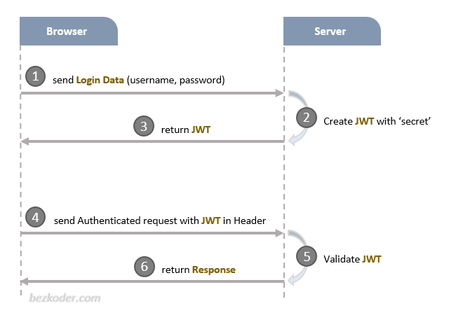 | 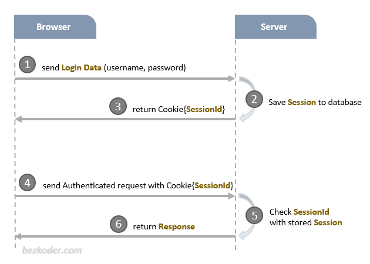 |

- [참고](https://throwfe.tistory.com/8)

## JWT를 웹 스토리지에 저장해야 한다면 어디다 저장하시겠나요? 이유는요?

일회성 로그인일 경우에는 사용자 인증 정보가 오래 유지될 수록 정보 탈취 위험성이 더 크기 때문에 금방 비워주기 위해서 세션 스토리지가 좋을 것 같고, 탭이 꺼져도 로그인 정보가 유지되어야 하는 경우는 편의성을 위해 로컬 스토리지에 저장할 것 같음.
+) 더 보안이 요구되는 인증이라면 쿠키에 보안 플래그를 설정하여 공격을 대비할 수 있기 때문에 쿠키를 사용할 것.

### 웹 스토리지 종류

| 종류          | 설명                                                                                                                                                                                                                                                                                             |
| ------------- | ------------------------------------------------------------------------------------------------------------------------------------------------------------------------------------------------------------------------------------------------------------------------------------------------ |
| 로컬 스토리지 | - 오리진이 같을 경우 데이터는 모든 탭과 창에서 공유 <br/> - 브라우저나 OS가 재시작하더라도 데이터가 파기되지 않음 <br/> - ex. 자동 로그인                                                                                                                                                        |
| 세션 스토리지 | - 로컬 스토리지와 제공하는 프로퍼티와 메서드는 같지만, 훨씬 제한적이기 때문에 자주 사용되진 않음 <br/> - 오리진이 같은 브라우저 탭, iframe에서 공유 <br/> - 새로 고침 시에는 데이터 유지, 탭을 닫고 새로 열 때는 데이터 사라짐 <br/> - ex. 일회성 로그인 정보, 새로고침 시 데이터 정보 유지 기능 |

- [참고](https://ko.javascript.info/localstorage)

### 쿠키 vs 웹 스토리지

웹 스토리지는 쿠키와 달리,

- 네트워크 요청 시 서버로 전송되지 않음
- 더 많은 자료 보관 가능
- 서버가 HTTP 헤더를 통해 스토리지 객체를 조작할 수 없음 (자바스크립트 내에서만 웹 스토리지 객체 조작 이루어짐)
- 도메인·프로토콜·포트로 정의되는 오리진(origin)에 묶여있기 때문에 프로토콜과 서브 도메인이 다르면 데이터에 접근 불가

## CORS가 뭔가요?

- Cross-Origin Resource Sharing
- 교차 출처 리소스 공유라는 의미로 웹 애플리케이션이 다른 출처의 리소스에 접근할 수 있도록 브라우저와 서버가 협력하는 방식
- 보안을 위해 동일 출처 정책을 따르는 브라우저에서 교차 출처 요청을 제한하기 때문에 발생하는 문제

## Origin이란?

- URI에서 protocol(scheme), hostname, port를 포함하는 영역

### 대처 방법

- 서버 측에서 허용하는 Origin, 메서드, 헤더 등을 응답 헤더에 명시
- Access-Control-Allow-Origin : 허용하는 출처 명시
- Access-Control-Allow-Methods : 허용하는 HTTP 메서드 명시
- Access-Control-Allow-Headers : 허용하는 HTTP 헤더 명시
- Access-Control-Allow-Credentials : 인증 정보(쿠키, HTTP 인증)를 함께 보낼 수 있도록 허용하는 지 여부 명시

\*서버 측에서는 요청 메서드가 GET, HEAD, POST가 아니거나, 특정 헤더나 인증 정보를 포함하는 요청에 대해서는 Preflight Request를 받음(실제 요청을 보내기 전에 OPTIONS 메서드로 요청을 보내서 서버의 요청 권한 허용 여부를 미리 확인하는 것) -> 서버는 Preflight Request에 대해서도 CORS 관련 헤더를 응답해야 함

### 우회 방법

- 프록시 서버 사용
- JSONP(JSON with Padding) 기법

## CORS를 겪고 직접 해결해 본 경험이 있으면 말해주세요

- 보통 서버 측에서 허용 권한을 설정해줘야 했기 때문에 CORS 문제 발생 시 백엔드 개발자 분께 이슈 전달
- 쿠키로 인증 처리 시 CORS 문제 해결을 위해 요청 보낼 때 withCredentials 옵션 허용해줌
- Secure 설정되어 http인 개발 서버에서 통신 어려움 발생 -> 개발 서버 실행 시 HTTPS로 열리도록 처리

# 개발 방법론

## 소프트웨어 개발 주기(SDLC)에 대해 아나요?

- 프로젝트를 개발하기 위해 시행되는 프로세스와 방법의 체계
- 분석 -> 설계 -> 구현 -> 테스트 -> 배포 -> (유지보수)

## 폭포수 방법론이란 뭔가요?

- [요청 -> 설계 -> 구현 -> 테스트 -> 배포] 구조로 체계적으로 진행되는 전통적인 방식
- 👎 지나치게 계획과 절차에 의존하기 때문에 시간과 비용 낭비

## 애자일 방법론이란 뭔가요?

- 소프트웨어 개발 프로세스를 더 효율적이고 유연하게 만들기 위한 방법론
- 변화에 빠르게 대응하며, 고객의 요구사항을 지속적으로 수용하고, 높은 품질의 소프트웨어를 신속하게 제공하는 것
- [요청 -> 설계 -> 구현 -> 테스트 -> 배포] 반복되는 구조
- 규모를 축소하고 주기를 짧게하여 테스트를 많이 가지는 방식

# Cache

## 캐시란 무엇인가요?

- CPU와 메인 메모리 간에 데이터 접근 시 속도 차이로 인한 `병목 현상`을 줄이기 위해 사용하는 메모리
- CPU에서 메인메모리에 있는 데이터를 가져올 때 자주 사용하는 데이터를 캐시에 저장

### 캐시 메모리에 어떤 메모리를 저장할 것인가?

> 지역성을 바탕으로 결정
> 지역성 : CPU가 자주 참조하는 데이터가 고르게 분포되지 않고, 특정 부분에 몰려 있는 것

- 시간 지역성: 최근 참조한 내용을 다시 참조할 가능성이 높다.

- 공간 지역성: 실제 참조한 주소 근처의 내용을 참조할 가능성이 높다.

### 매핑 방식

> 캐싱 라인 : 데이터들의 주소가 기록된 태그들의 묶음

- 직접 매핑 - 메인 메모리 일정 크기로 나눈 후 각 영역 매핑
- 연관 매핑 - 규칙 없이 임의로 매핑
- 집합 연관 매핑 - 직접 + 연관 매핑

### CPU 메모리 접근 방식

- 캐시 hit - 데이터가 있을 때
- 캐시 miss - 데이터가 없을 때

