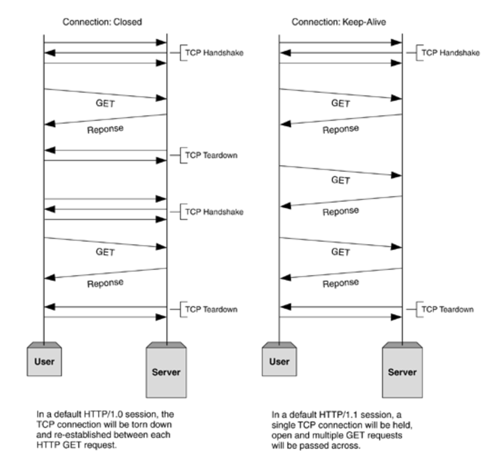
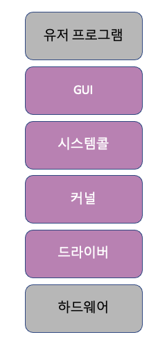

## 네트워크에서 패킷이란 무엇을 의미하나요?

네트워크를 통해 전송하기 위한 데이터의 단위  
데이터를 효율적으로 전송하기 위해 사용되며 헤더, 페이로드, 트레일러로 구성

- 헤더: 패킷의 제어 정보가 포함된 부분
  - 송신자와 수신자의 IP 주소, 패킷 번호, 프로토콜 정보 등의 필요한 정보가 담겨있다.
- 페이로드: 실제 전송하려는 데이터가 포함된 부분
- 트레일러: 오류 검출을 위한 정보가 포함된다

## 네트워크에서 처리량은 무엇을 의미하나요?

네트워크를 통해 성공적으로 전달된 평균 데이터의 양을 의미  
처리량은 초당 비트 수(bps)로 표현된다.  

## 지연시간이란 무엇인가요?

네트워크에서 데이터가 출발지에서 목적지까지 도달하는데 걸리는 시간을 의미  
지연시간이 짧다 = 데이터가 빠르게 전송된다  
지연시간이 길다 = 데이터 전송이 느리다  

매체 타입(무선, 유선), 패킷 크기, 라우터의 패킷 처리 시간에 영향을 받는다.

<!-- 240827 -->

## 처리량은 어떤 상황에 영향을 받나요?

- 사용자들이 많이 접속할 때마다 커지는 트래픽
- 네트워크 장치 간의 대역폭
- 네트워크 중간에 발생하는 에러
- 장치의 하드웨어 스펙

## 네트워크 병목현상은 무엇인가요?

병목현상은 전체 시스템이나 흐름에서 한 부분이 다른 부분들보다 처리 속도가 느려서 전체적인 성능 저하를 일으키는 상황이다.

네트워크 병목 현상의 주된 원인

- 네트워크 대역폭
- 네트워크 토폴로지
- 서버 CPU, 메모리 사용량
- 비효율적인 네트워크 구성

## TCP/IP 가 무엇인가요? 각 계층에 대해서 설명할 수 있나요?

인터넷에서 컴퓨터들이 서로 데이터를 주고받기 위한 프로토콜의 집합이다.
TCP/IP는 링크 계층, 인터넷 계층, 전송 계층, 애플리케이션(응용) 계층으로 나누어져 있다.

### 애플리케이션 계층

FTP, HTTP, SSH, SMTP, DNS 등 응용 프로그램이 사용되는 프로토콜 계층  
웹 서비스, 이메일 등 서비스를 실질적으로 사람들에게 제공하는 층

- FTP는 장치간의 파일을 전송하는데 사용되는 프로토콜
- HTTP는 웹 사이트와 서버 간의 데이터를 주고 받기 위한 프로토콜
- SMTP는 전자 메일 전송을 위한 인터넷 표준 통신 프로토콜
- DNS는 도메인 이름과 IP 주소를 매핑해주는 서버

### 전송 계층

- 전송계층은 송신자와 수신자를 연결하는 통신 서비스를 제공
- 신뢰성, 흐름 제어를 제공할 수 있다
- 애플리케이션과 인터넷 계층 사이의 데이터가 전달될 때 중계 역할을 함
  (대표적으로 TCP/UDP)

### 인터넷 계층

인터넷 계층은 장치로부터 받은 네트워크 패킷을 IP 주소로 지정된 목적지로 전송하기 위해 사용되는 계층

### 링크계층

링크 계층은 전선, 광섬유, 무선 등으로 실질적으로 데이터를 전달하며 장치 간에 신호를 주고받는 규칙을 정하는 계층

## 전송 계층의 대표적인 방식은 무엇이 있고 어떤 차이가 있나요? (키워드: TCP, UDP)

전송계층의 대표적인 방식은 TCP와 UDP가 있다.

TCP

- 패킷 사이의 순서를 보장하고 연결지향 프로토콜로 송신자와 수신자 간의 연결해서 신뢰성을 보장한다.
- 가상 회선 패킷 교환 방식이라 안정적으로 순서대로 전송할 수 있다.
- (ex. 파일 전송, 이메일 등)
- UDP에 비해 속도가 느리다는 단점
   

UDP

- 비연결형 프로토콜로 각각의 패킷은 독립적으로 전송돼서 순서나 전송 확인을 보장하지 않는다.
- 속도가 빠르다.
- 신뢰성 있는 데이터 전송을 보장하지 못한다.
- (ex. 실시간 스트리밍)

## 계층 간 데이터 송수신 과정에 대해 설명할 수 있나요? (키워드: 캡슐화, 비캡슐화)

캡슐화

- 상위 계층의 헤더와 데이터를 하위 계층의 데이터 부분에 포함시키고 해당 계층의 헤더를 삽입하는 과정이다.

비캡슐화

- 하위 계층에서 상위 계층으로 가며 각 계층의 헤더 부분을 제거하는 과정이다.

## 네트워크에서 PDU에 대해 알고 있나요?

- PDU는 네트워크 통신에서 데이터를 주고받을 때, 특정 계층에서 교환되는 데이터의 기본 단위
- 애플리케이션 계층: 메시지
- 전송 계층: 세그먼트(TCP), 데이터그램(UDP)
- 인터넷 계층: 패킷
- 링크 계층: 프레임(데이터 링크 계층), 비트(물리 계층)

## 로드밸런서란 무엇인가요?

로드밸런서는 서버의 부하를 분산하는 기기이다.
로드밸런서는 2대 이상의 서버를 기반으로 가상 IP를 제공하고 이를 기반으로 안정적인 서비스를 제공한다.

## ARP란 무엇인가요?

- ARP(Address Resolution Protocol)는 IP 주소(논리적 주소)를 MAC 주소(물리적 주소)로 변환하는 프로토콜입니다.

## MAC 주소란 무엇인가요?

- MAC 주소(Media Access Control Address)는 네트워크 인터페이스 카드(NIC)에 할당된 고유한 식별번호
- MAC 주소는 물리적 주소이다
- 컴퓨터나 노트북 등 각 장치에는 네트워크에 연결하기 위한 장치(LAN 카드)가 있는데 이를 구별하기 위한 식별번호이다.

## NAT란 무엇인가요?

- 네트워크 경로를 통해 전송되는 패킷의 IP 주소를 변환하는 기술
- NAT(Network Address Translation)는 패킷이 라우팅 장치를 통해 전송되는 동안 패킷의 IP 주소 정보를 수정하여 IP 주소를 다른 주소로 매핑하는 방법

### NAT을 사용하는 이유

- 하나의 공인 IP 주소를 사용해 여러 대의 내부 네트워크 장치들이 외부 인터넷에 접속할 수 있도록 하기 위해 사용

### NAT 장단점

- 장점: 내부 네트워크에서 사용하는 IP 주소와 외부에 드러나는 IP 주소를 다르게 유지하여 내부 네트워크를 보호할 수 있다.
- 단점: 다수의 장치가 하나의 공인 IP 주소를 공유하므로, 사용자가 많아질 경우 네트워크 속도가 느려질 수 있다.

<!-- HTTP -->

## HTTP란 뭔가요?

HTTP는 Hyper Text Transfer Protocol의 약자로 인터넷에서 데이터를 서로 주고받기 위한 통신규약이다.

HTTP는 요청(Request)과 응답(Response)의 형태로 이루어져 있다. 클라이언트는 HTTP 요청 메시지를 서버에 전송하고, 서버는 이 요청에 대한 응답 메시지를 클라이언트에게 전송한다. 요청과 응답은 각각 헤더와 바디로 구성된다. 헤더는 요청이나 응답에 대한 메타데이터를 포함하고, 바디는 요청이나 응답에 대한 실제 데이터를 포함한다.

## HTTP 프로토콜의 가장 큰 특징은 뭔가요?

- 가장 큰 특징은 **무상태 프로토콜(stateless)**이다.

  - HTTP에서 서버가 클라이언트의 상태를 보존하지 않는 것을 의미 (요청과 응답이 독립적으로 관리)
  - 장점: 서버 확장성이 높다
  - 단점: 클라이언트가 추가 데이터를 전송해야 함

  / 추가적인 특징 /

- 클라이언트 서버 구조
  - 클라이언트가 서버에 요청을 보내면 서버는 그에 대한 응답을 보내는 클라이언트 서버 구조
- 비연결성(Connectionless)
  - 클라이언트 요청에 서버가 응답을 마치면 연결을 종료함
  - 최소한의 자원으로 서버 유지 가능
  - TCP/IP 연결을 계속해서 새로 맺어야 하므로 3-way-handshake 시간이 추가된다는 단점

## URL은 뭔가요?

URL은 Uniform Resource Locator의 약자로 서버에 자원(resource)를 요청하기 위해 입력하는 영문 주소  
네트워크 상에서 리소스(웹 페이지, 이미지, 동영상 등의 파일) 위치한 정보를 나타낸다.

### URL 구조

- scheme : 사용할 프로토콜을 뜻하며 웹에서는 http 또는 https를 사용
- host : 요청하는 웹 서버의 도메인 이름을 나타낸다. 위 사진에선 www.example.com을 의미
- port : http의 기본 포트 번호
- path : 접근할 대상(서버)의 경로에 대한 상세 정보 / 서버 내에서 요청한 자원의 위치
- query : 접근할 대상에 전달하는 추가적인 정보 (파라미터)
- fragment : 메인 리소스 내에 존재하는 서브 리소스에 접근할 때 이를 식별하기 위한 정보

**url은 식별자도 포함할 수 있지만 엄격히 따지자면 scheme, host, port, path까지가 기본적인 url의 구성 요소이다.**

참고자료 -
https://inpa.tistory.com/entry/WEB-%F0%9F%8C%90-URL-URI-%EC%B0%A8%EC%9D%B4

## HTTP/1.0 과 HTTP/1.1의 차이는 뭔가요?

지속성이다.

HTTP/1.0은 매번 TCP 연결을 해서 파일을 송수신 하는데 HTTP/1.1은 한 번 TCP 초기화를 한 이후에 keep-alive라는 옵션으로 여러 개의 파일을 송수신할 수 있다.

// + 파이프라이닝  
HTTP/1.0에서는 요청에 대한 응답이 와야 다음 응답을 보낼 수 있다.  
HTTP/1.1에서는 요쳥을 병렬로 처리할 수 있는 파이프라이닝 기능을 지원한다.  
=> 여러 개의 요청을 처리하는 응답 속도가 빨라지게 된다.

## HTTP/1.1 과 HTTP/2.0의 차이는 뭔가요?

HTTP/2.0은 지연 시간을 줄이고 응답 시간을 더 빠르게 할 수 있으며 멀티플렉싱, 헤더 압축, 서버 푸시, 요청의 우선순위 처리를 지원하는 프로토콜이다.

1. 멀티플렉싱

- 여러 개의 스트림을 사용하여 송수신한다는 것
- 스트림이란? 요청과 응답을 처리하는 개별적인 단위

- HTTP/1.1: 하나의 연결에서 하나의 요청과 응답이 처리된다. 병렬 요청을 처리하려면 여러 연결을 생성해야 하며, 이로 인해 네트워크 지연이나 혼잡이 발생할 수 있다.

- HTTP/2.0: 하나의 연결에서 여러 요청과 응답을 동시에 처리할 수 있는 다중화(Multiplexing)가 지원된다. 이로 인해 한 연결에서 여러 리소스를 동시에 다운로드할 수 있어 성능이 향상된다.

2. 헤더 압축

- HTTP/1.1: 각 요청마다 전체 헤더를 보내야 했으며, 이로 인해 대용량 헤더를 전송할 경우 비효율적이다.

- HTTP/2.0: 헤더 정보를 HPACK 압축 방식을 사용해 압축한다. 이를 통해 헤더 크기를 줄이고, 네트워크 대역폭을 절약할 수 있다.

3. Server Push (서버 푸시)

- 클라이언트의 요청 없이 서버가 바로 리소스를 푸시할 수 있다.
- ex. html에는 css나 js 파일이 포함되기 마련인데 html을 읽으면서 그 안에 들어있던 css 파일을 서버에서 푸시하여 클라이언트에 먼저 줄 수 있다.

멀티플렉싱과 서버 푸시가 HTTP/2의 가장 큰 장점이라고 생각한다..!

## HTTPS는 HTTP랑 뭐가 다른가요?

- HTTPS는 SSL/TLS를 사용하여 데이터를 암호화하고, 서버 인증서를 통해 신뢰성을 보장하는 프로토콜로 보안성이 뛰어나다.
- SSL(Secure Socket Layer)/TLS(Transport Layer Security Protocol)은 전송 계층에서 보안을 제공하는 프로토콜이다.

## (심화) 공개키 (비대칭키) 방식이 뭔가요?

공개키: 공개되어있는 키  
개인키: 비밀키라고 하며, 소유자만이 알고 있는 키로 공개키로 암호화된 데이터를 복호화할 때 사용

1.  대칭키 암호화 방식  

- 단일 키를 사용하여 데이터를 암호화하고 복호화한다.
- 대칭키는 암호화키가 동일하므로 해당 키를 아는 사람이 문서를 복호화할 수 있다.
- 공개키 암호화 방식에 비해 **연산 속도가 빠르다는 장점**이 있지만 키가 유출되면 데이터가 쉽게 해독될 수 있어 **키를 교환해야 하는 문제가 발생**한다.

2. 공개(비대칭)키 암호화 방식

- 두 개의 키를 사용하여 암호화와 복호화한다.
- 하나는 공개키이고 다른 하나는 개인키이다.
- 공개키로 암호화된 데이터는 개인키 없이는 해독할 수 없다. 따라서 개인키는 비밀로 유지할 수 있으며 공개키는 안전하게 배포할 수 있다.
- 암호화와 복호화 과정이 대칭키 암호화보다 **처리속도가 느리다**.

<!-- 운영체제 -->

## 운영체제란 무엇인가요?

운영체제는 시스템 자원을 관리하고 사용자가 컴퓨터를 사용할 수 있는 환경을 제공한다.

ex. Window, MAC OS, Unix, Linux, Android, iOS

## 운영체제는 어떤 역할을 하나요?

1. CPU 스케줄링과 프로세스 관리

   - CPU 소유권을 어떤 프로세스에게 할당할지
   - 프로세스의 생성과 삭제
   - 자원 할당 및 반환을 관리

2. 메모리 관리

   - 한정된 메모리를 어떤 프로세스에 얼만큼 할당해야 하는지 관리

3. 디스크 파일 관리

   - 디스크 파일을 어떠한 방법으로 보관할지 관리

4. I/O 디바이스 관리
   - I/O 디바이스들인 마우스, 키보드와 컴퓨터 간에 데이터를 주고받는 것을 관리

## 운영체제는 어떤 구조로 이루어져 있나요?

  
보라색 부분이 운영체제  

- GUI(Graphical User Interface)

  - 사용자와 컴퓨터 간의 상호작용을 시각적으로 제공하는 인터페이스
  - 아이콘, 창, 버튼 등 시각적 요소를 통해 사용자가 컴퓨터를 쉽게 사용할 수 있도록 도와준다.

  - 인터페이스란? 서로 다른 두 요소가 서로 소통할 수 있도록 돕는 접점이나 경로다.

  - 시스템 콜(System Call)
  - 시스템 콜은 운영체제가 커널에 접근하기 위한 인터페이스
  - 사용자 프로그램이 운영체제의 커널 모드 기능을 호출하여 파일을 열거나 프로세스를 생성하거나 메모리를 할당하는 등의 작업을 수행할 수 있게 한다.

- 커널(Kernel) ⭐

  - 커널은 운영체제의 핵심 부분으로 하드웨어와 직접 상호작용하며 시스템 자원을 관리한다.
  - 프로세스 관리, 메모리 관리, 파일 시스템 관리, 하드웨어 제어 등의 기능을 담당한다.

- 드라이버

  - 하드웨어 장치의 제어와 관리를 담당한다.
  - 장치의 특정 기능을 운영체제에 통합하여 사용자가 쉽게 사용할 수 있도록 한다.

  **상호작용 예시**

  1. 사용자가 GUI에서 파일 탐색기를 실행
  2. GUI는 사용자의 요청을 처리하기 위해 시스템 콜을 사용하여 파일 시스템에 접근
  3. 시스템 콜을 받은 커널은 파일 시스템을 관리하는 모듈을 호출하여 디렉토리의 내용을 요청
  4. 커널은 요청된 내용을 얻기 위해 하드 드라이브의 드라이버를 통해 실제 디스크에 접근
  5. 하드 드라이브의 드라이버는 디스크에서 데이터를 읽어온 후, 이 데이터를 커널에 전달
  6. 커널은 받은 데이터를 GUI로 전달하여, 사용자가 파일 탐색기에서 파일 목록을 확인할 수 있도록 함

## 컴퓨터는 어떤 요소로 이루어져 있나요?

- CPU
- DMA 컨트롤러
- 메모리
- 타이머
- 디바이스 컨트롤러

## CPU는 어떤 요소로 이루어져 있나요?

CPU는 컴퓨터의 핵심 처리 장치로, 연산 작업과 명령어 실행을 담당한다.

- 산술논리연산장치
- 제어장치
- 레지스터

로 구성되어있다.  
cpu는 인터럽트에 의해 단순히 메모리에 존재하는 명령어를 해석해서 실행하는 일꾼이다.

## CPU는 어떻게 동작하나요?

CPU는 `인출` - `해석` - `실행` 으로 이루어진다.

- Fetch: 프로그램 카운터(PC)가 가리키는 메모리 주소에서 명령어를 가져와 **명령어 레지스터(IR)** 에 저장한다.
- Decode: **제어 유닛(Control Unit)** 이 명령어를 해석하여 어떤 작업을 수행할지 결정한다.
- Execute: **ALU(산술 논리 유닛)** 가 명령어에 따라 연산을 수행합니다. 필요한 데이터는 레지스터나 메모리에서 가져오며, 결과는 Accumulator나 다른 레지스터에 저장될 수 있다.
