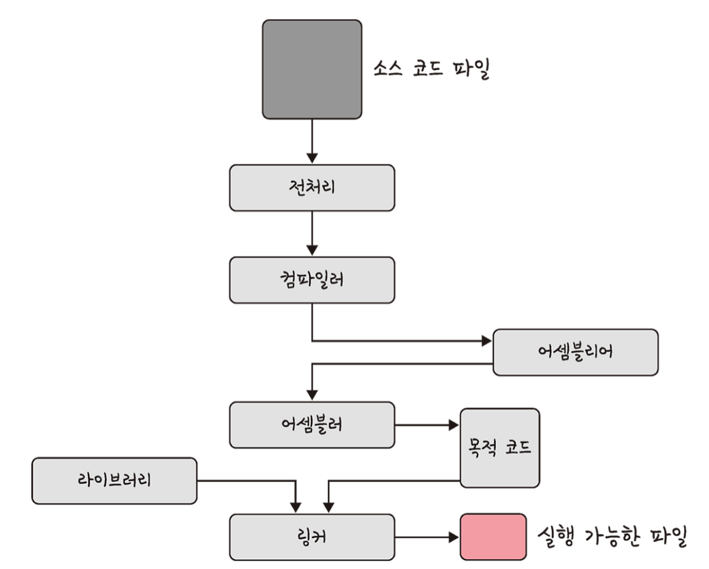
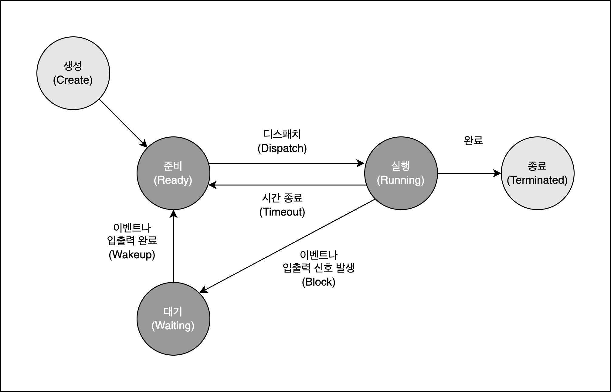
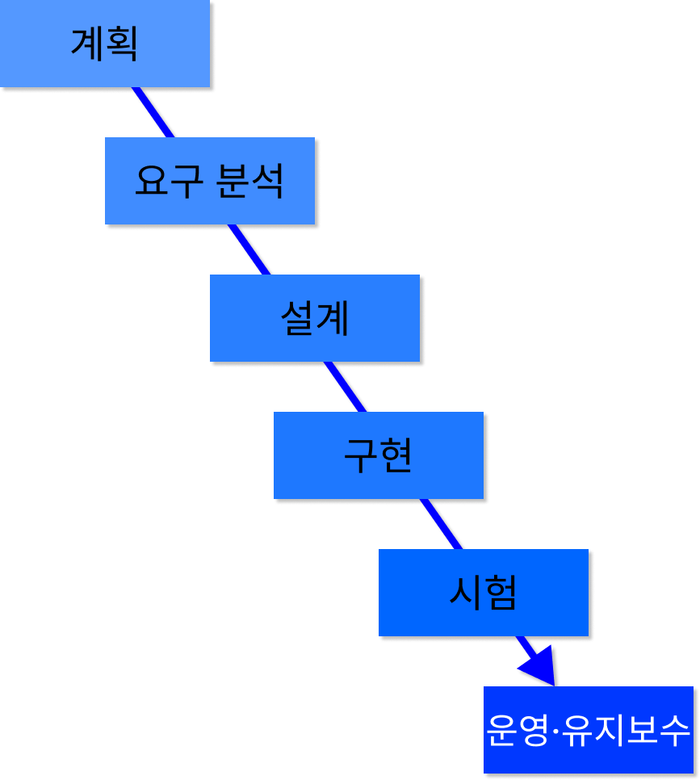
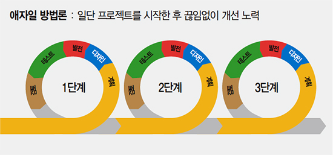

## 네트워크에서 패킷이란 무엇을 의미하나요?

네트워크를 통해 전송하기 위한 데이터의 단위 <br>
데이터를 효율적으로 전송하기 위해 사용되며 헤더, 페이로드, 트레일러로 구성

- 헤더: 패킷의 제어 정보가 포함된 부분
  - 송신자와 수신자의 IP 주소, 패킷 번호, 프로토콜 정보 등의 필요한 정보가 담겨있다.
- 페이로드: 실제 전송하려는 데이터가 포함된 부분
- 트레일러: 오류 검출을 위한 정보가 포함된다

## 네트워크에서 처리량은 무엇을 의미하나요?

네트워크를 통해 성공적으로 전달된 평균 데이터의 양을 의미 <br>
처리량은 초당 비트 수(bps)로 표현된다. <br>

## 지연시간이란 무엇인가요?

네트워크에서 데이터가 출발지에서 목적지까지 도달하는데 걸리는 시간을 의미 <br>
지연시간이 짧다 = 데이터가 빠르게 전송된다 <br>
지연시간이 길다 = 데이터 전송이 느리다 <br>

매체 타입(무선, 유선), 패킷 크기, 라우터의 패킷 처리 시간에 영향을 받는다.

<!-- 240827 -->

## 처리량은 어떤 상황에 영향을 받나요?

- 사용자들이 많이 접속할 때마다 커지는 트래픽
- 네트워크 장치 간의 대역폭
- 네트워크 중간에 발생하는 에러
- 장치의 하드웨어 스펙

## 네트워크 병목현상은 무엇인가요?

병목현상은 전체 시스템이나 흐름에서 한 부분이 다른 부분들보다 처리 속도가 느려서 전체적인 성능 저하를 일으키는 상황이다.

네트워크 병목 현상의 주된 원인

- 네트워크 대역폭
- 네트워크 토폴로지
- 서버 CPU, 메모리 사용량
- 비효율적인 네트워크 구성

## TCP/IP 가 무엇인가요? 각 계층에 대해서 설명할 수 있나요?

인터넷에서 컴퓨터들이 서로 데이터를 주고받기 위한 프로토콜의 집합이다.
TCP/IP는 링크 계층, 인터넷 계층, 전송 계층, 애플리케이션(응용) 계층으로 나누어져 있다.

### 애플리케이션 계층

FTP, HTTP, SSH, SMTP, DNS 등 응용 프로그램이 사용되는 프로토콜 계층 <br>
웹 서비스, 이메일 등 서비스를 실질적으로 사람들에게 제공하는 층

- FTP는 장치간의 파일을 전송하는데 사용되는 프로토콜
- HTTP는 웹 사이트와 서버 간의 데이터를 주고 받기 위한 프로토콜
- SMTP는 전자 메일 전송을 위한 인터넷 표준 통신 프로토콜
- DNS는 도메인 이름과 IP 주소를 매핑해주는 서버

### 전송 계층

- 전송계층은 송신자와 수신자를 연결하는 통신 서비스를 제공
- 신뢰성, 흐름 제어를 제공할 수 있다
- 애플리케이션과 인터넷 계층 사이의 데이터가 전달될 때 중계 역할을 함
  (대표적으로 TCP/UDP)

### 인터넷 계층

인터넷 계층은 장치로부터 받은 네트워크 패킷을 IP 주소로 지정된 목적지로 전송하기 위해 사용되는 계층

### 링크계층

링크 계층은 전선, 광섬유, 무선 등으로 실질적으로 데이터를 전달하며 장치 간에 신호를 주고받는 규칙을 정하는 계층

## 전송 계층의 대표적인 방식은 무엇이 있고 어떤 차이가 있나요? (키워드: TCP, UDP)

전송계층의 대표적인 방식은 TCP와 UDP가 있다.

TCP

- 패킷 사이의 순서를 보장하고 연결지향 프로토콜로 송신자와 수신자 간의 연결해서 신뢰성을 보장한다.
- 가상 회선 패킷 교환 방식이라 안정적으로 순서대로 전송할 수 있다.
- (ex. 파일 전송, 이메일 등)
- UDP에 비해 속도가 느리다는 단점
  <br>

UDP

- 비연결형 프로토콜로 각각의 패킷은 독립적으로 전송돼서 순서나 전송 확인을 보장하지 않는다.
- 속도가 빠르다.
- 신뢰성 있는 데이터 전송을 보장하지 못한다.
- (ex. 실시간 스트리밍)

## 계층 간 데이터 송수신 과정에 대해 설명할 수 있나요? (키워드: 캡슐화, 비캡슐화)

캡슐화

- 상위 계층의 헤더와 데이터를 하위 계층의 데이터 부분에 포함시키고 해당 계층의 헤더를 삽입하는 과정이다.

비캡슐화

- 하위 계층에서 상위 계층으로 가며 각 계층의 헤더 부분을 제거하는 과정이다.

## 네트워크에서 PDU에 대해 알고 있나요?

- PDU는 네트워크 통신에서 데이터를 주고받을 때, 특정 계층에서 교환되는 데이터의 기본 단위
- 애플리케이션 계층: 메시지
- 전송 계층: 세그먼트(TCP), 데이터그램(UDP)
- 인터넷 계층: 패킷
- 링크 계층: 프레임(데이터 링크 계층), 비트(물리 계층)

## 로드밸런서란 무엇인가요?

로드밸런서는 서버의 부하를 분산하는 기기이다.
로드밸런서는 2대 이상의 서버를 기반으로 가상 IP를 제공하고 이를 기반으로 안정적인 서비스를 제공한다.

## ARP란 무엇인가요?

- ARP(Address Resolution Protocol)는 IP 주소(논리적 주소)를 MAC 주소(물리적 주소)로 변환하는 프로토콜입니다.

## MAC 주소란 무엇인가요?

- MAC 주소(Media Access Control Address)는 네트워크 인터페이스 카드(NIC)에 할당된 고유한 식별번호
- MAC 주소는 물리적 주소이다
- 컴퓨터나 노트북 등 각 장치에는 네트워크에 연결하기 위한 장치(LAN 카드)가 있는데 이를 구별하기 위한 식별번호이다.

## NAT란 무엇인가요?

- 네트워크 경로를 통해 전송되는 패킷의 IP 주소를 변환하는 기술
- NAT(Network Address Translation)는 패킷이 라우팅 장치를 통해 전송되는 동안 패킷의 IP 주소 정보를 수정하여 IP 주소를 다른 주소로 매핑하는 방법

### NAT을 사용하는 이유

- 하나의 공인 IP 주소를 사용해 여러 대의 내부 네트워크 장치들이 외부 인터넷에 접속할 수 있도록 하기 위해 사용

### NAT 장단점

- 장점: 내부 네트워크에서 사용하는 IP 주소와 외부에 드러나는 IP 주소를 다르게 유지하여 내부 네트워크를 보호할 수 있다.
- 단점: 다수의 장치가 하나의 공인 IP 주소를 공유하므로, 사용자가 많아질 경우 네트워크 속도가 느려질 수 있다.

<!-- HTTP -->

## HTTP란 뭔가요?

HTTP는 Hyper Text Transfer Protocol의 약자로 인터넷에서 데이터를 서로 주고받기 위한 통신규약이다.

HTTP는 요청(Request)과 응답(Response)의 형태로 이루어져 있다. 클라이언트는 HTTP 요청 메시지를 서버에 전송하고, 서버는 이 요청에 대한 응답 메시지를 클라이언트에게 전송한다. 요청과 응답은 각각 헤더와 바디로 구성된다. 헤더는 요청이나 응답에 대한 메타데이터를 포함하고, 바디는 요청이나 응답에 대한 실제 데이터를 포함한다.

## HTTP 프로토콜의 가장 큰 특징은 뭔가요?

- 가장 큰 특징은 **무상태 프로토콜(stateless)**이다.

  - HTTP에서 서버가 클라이언트의 상태를 보존하지 않는 것을 의미 (요청과 응답이 독립적으로 관리)
  - 장점: 서버 확장성이 높다
  - 단점: 클라이언트가 추가 데이터를 전송해야 함

  / 추가적인 특징 /

- 클라이언트 서버 구조
  - 클라이언트가 서버에 요청을 보내면 서버는 그에 대한 응답을 보내는 클라이언트 서버 구조
- 비연결성(Connectionless)
  - 클라이언트 요청에 서버가 응답을 마치면 연결을 종료함
  - 최소한의 자원으로 서버 유지 가능
  - TCP/IP 연결을 계속해서 새로 맺어야 하므로 3-way-handshake 시간이 추가된다는 단점

## URL은 뭔가요?

URL은 Uniform Resource Locator의 약자로 서버에 자원(resource)를 요청하기 위해 입력하는 영문 주소 <br>
네트워크 상에서 리소스(웹 페이지, 이미지, 동영상 등의 파일) 위치한 정보를 나타낸다.

### URL 구조


- scheme : 사용할 프로토콜을 뜻하며 웹에서는 http 또는 https를 사용
- host : 요청하는 웹 서버의 도메인 이름을 나타낸다. 위 사진에선 www.example.com을 의미
- port : http의 기본 포트 번호
- path : 접근할 대상(서버)의 경로에 대한 상세 정보 / 서버 내에서 요청한 자원의 위치
- query : 접근할 대상에 전달하는 추가적인 정보 (파라미터)
- fragment : 메인 리소스 내에 존재하는 서브 리소스에 접근할 때 이를 식별하기 위한 정보

**url은 식별자도 포함할 수 있지만 엄격히 따지자면 scheme, host, port, path까지가 기본적인 url의 구성 요소이다.**

참고자료 -
https://inpa.tistory.com/entry/WEB-%F0%9F%8C%90-URL-URI-%EC%B0%A8%EC%9D%B4

## HTTP/1.0 과 HTTP/1.1의 차이는 뭔가요?


지속성이다.

HTTP/1.0은 매번 TCP 연결을 해서 파일을 송수신 하는데 HTTP/1.1은 한 번 TCP 초기화를 한 이후에 keep-alive라는 옵션으로 여러 개의 파일을 송수신할 수 있다.

// + 파이프라이닝 <br>
HTTP/1.0에서는 요청에 대한 응답이 와야 다음 응답을 보낼 수 있다. <br>
HTTP/1.1에서는 요쳥을 병렬로 처리할 수 있는 파이프라이닝 기능을 지원한다. <br>
=> 여러 개의 요청을 처리하는 응답 속도가 빨라지게 된다.

## HTTP/1.1 과 HTTP/2.0의 차이는 뭔가요?

HTTP/2.0은 지연 시간을 줄이고 응답 시간을 더 빠르게 할 수 있으며 멀티플렉싱, 헤더 압축, 서버 푸시, 요청의 우선순위 처리를 지원하는 프로토콜이다.

1. 멀티플렉싱

- 여러 개의 스트림을 사용하여 송수신한다는 것
- 스트림이란? 요청과 응답을 처리하는 개별적인 단위

- HTTP/1.1: 하나의 연결에서 하나의 요청과 응답이 처리된다. 병렬 요청을 처리하려면 여러 연결을 생성해야 하며, 이로 인해 네트워크 지연이나 혼잡이 발생할 수 있다.

- HTTP/2.0: 하나의 연결에서 여러 요청과 응답을 동시에 처리할 수 있는 다중화(Multiplexing)가 지원된다. 이로 인해 한 연결에서 여러 리소스를 동시에 다운로드할 수 있어 성능이 향상된다.

2. 헤더 압축

- HTTP/1.1: 각 요청마다 전체 헤더를 보내야 했으며, 이로 인해 대용량 헤더를 전송할 경우 비효율적이다.

- HTTP/2.0: 헤더 정보를 HPACK 압축 방식을 사용해 압축한다. 이를 통해 헤더 크기를 줄이고, 네트워크 대역폭을 절약할 수 있다.

3. Server Push (서버 푸시)

- 클라이언트의 요청 없이 서버가 바로 리소스를 푸시할 수 있다.
- ex. html에는 css나 js 파일이 포함되기 마련인데 html을 읽으면서 그 안에 들어있던 css 파일을 서버에서 푸시하여 클라이언트에 먼저 줄 수 있다.

멀티플렉싱과 서버 푸시가 HTTP/2의 가장 큰 장점이라고 생각한다..!

## HTTPS는 HTTP랑 뭐가 다른가요?

- HTTPS는 SSL/TLS를 사용하여 데이터를 암호화하고, 서버 인증서를 통해 신뢰성을 보장하는 프로토콜로 보안성이 뛰어나다.
- SSL(Secure Socket Layer)/TLS(Transport Layer Security Protocol)은 전송 계층에서 보안을 제공하는 프로토콜이다.

## (심화) 공개키 (비대칭키) 방식이 뭔가요?

공개키: 공개되어있는 키 <br>
개인키: 비밀키라고 하며, 소유자만이 알고 있는 키로 공개키로 암호화된 데이터를 복호화할 때 사용

1.  대칭키 암호화 방식 <br>

- 단일 키를 사용하여 데이터를 암호화하고 복호화한다.
- 대칭키는 암호화키가 동일하므로 해당 키를 아는 사람이 문서를 복호화할 수 있다.
- 공개키 암호화 방식에 비해 **연산 속도가 빠르다는 장점**이 있지만 키가 유출되면 데이터가 쉽게 해독될 수 있어 **키를 교환해야 하는 문제가 발생**한다.

2. 공개(비대칭)키 암호화 방식

- 두 개의 키를 사용하여 암호화와 복호화한다.
- 하나는 공개키이고 다른 하나는 개인키이다.
- 공개키로 암호화된 데이터는 개인키 없이는 해독할 수 없다. 따라서 개인키는 비밀로 유지할 수 있으며 공개키는 안전하게 배포할 수 있다.
- 암호화와 복호화 과정이 대칭키 암호화보다 **처리속도가 느리다**.

<!-- 운영체제 -->

## 운영체제란 무엇인가요?

운영체제는 시스템 자원을 관리하고 사용자가 컴퓨터를 사용할 수 있는 환경을 제공한다.

ex. Window, MAC OS, Unix, Linux, Android, iOS

## 운영체제는 어떤 역할을 하나요?

1. CPU 스케줄링과 프로세스 관리

   - CPU 소유권을 어떤 프로세스에게 할당할지
   - 프로세스의 생성과 삭제
   - 자원 할당 및 반환을 관리

2. 메모리 관리

   - 한정된 메모리를 어떤 프로세스에 얼만큼 할당해야 하는지 관리

3. 디스크 파일 관리

   - 디스크 파일을 어떠한 방법으로 보관할지 관리

4. I/O 디바이스 관리
   - I/O 디바이스들인 마우스, 키보드와 컴퓨터 간에 데이터를 주고받는 것을 관리

## 운영체제는 어떤 구조로 이루어져 있나요?

 <br>
보라색 부분이 운영체제 <br>

- GUI(Graphical User Interface)

  - 사용자와 컴퓨터 간의 상호작용을 시각적으로 제공하는 인터페이스
  - 아이콘, 창, 버튼 등 시각적 요소를 통해 사용자가 컴퓨터를 쉽게 사용할 수 있도록 도와준다.

  - 인터페이스란? 서로 다른 두 요소가 서로 소통할 수 있도록 돕는 접점이나 경로다.

  - 시스템 콜(System Call)
  - 시스템 콜은 운영체제가 커널에 접근하기 위한 인터페이스
  - 사용자 프로그램이 운영체제의 커널 모드 기능을 호출하여 파일을 열거나 프로세스를 생성하거나 메모리를 할당하는 등의 작업을 수행할 수 있게 한다.

- 커널(Kernel) ⭐

  - 커널은 운영체제의 핵심 부분으로 하드웨어와 직접 상호작용하며 시스템 자원을 관리한다.
  - 프로세스 관리, 메모리 관리, 파일 시스템 관리, 하드웨어 제어 등의 기능을 담당한다.

- 드라이버

  - 하드웨어 장치의 제어와 관리를 담당한다.
  - 장치의 특정 기능을 운영체제에 통합하여 사용자가 쉽게 사용할 수 있도록 한다.

  **상호작용 예시**

  1. 사용자가 GUI에서 파일 탐색기를 실행
  2. GUI는 사용자의 요청을 처리하기 위해 시스템 콜을 사용하여 파일 시스템에 접근
  3. 시스템 콜을 받은 커널은 파일 시스템을 관리하는 모듈을 호출하여 디렉토리의 내용을 요청
  4. 커널은 요청된 내용을 얻기 위해 하드 드라이브의 드라이버를 통해 실제 디스크에 접근
  5. 하드 드라이브의 드라이버는 디스크에서 데이터를 읽어온 후, 이 데이터를 커널에 전달
  6. 커널은 받은 데이터를 GUI로 전달하여, 사용자가 파일 탐색기에서 파일 목록을 확인할 수 있도록 함

## 컴퓨터는 어떤 요소로 이루어져 있나요?

- CPU
- DMA 컨트롤러
- 메모리
- 타이머
- 디바이스 컨트롤러

## CPU는 어떤 요소로 이루어져 있나요?

CPU는 컴퓨터의 핵심 처리 장치로, 연산 작업과 명령어 실행을 담당한다.

- 산술논리연산장치
- 제어장치
- 레지스터

로 구성되어있다. <br>
cpu는 인터럽트에 의해 단순히 메모리에 존재하는 명령어를 해석해서 실행하는 일꾼이다.

## CPU는 어떻게 동작하나요?

CPU는 `인출` - `해석` - `실행` 으로 이루어진다.

- Fetch: 프로그램 카운터(PC)가 가리키는 메모리 주소에서 명령어를 가져와 **명령어 레지스터(IR)** 에 저장한다.
- Decode: **제어 유닛(Control Unit)** 이 명령어를 해석하여 어떤 작업을 수행할지 결정한다.
- Execute: **ALU(산술 논리 유닛)** 가 명령어에 따라 연산을 수행합니다. 필요한 데이터는 레지스터나 메모리에서 가져오며, 결과는 Accumulator나 다른 레지스터에 저장될 수 있다.

## 메모리란 무엇인가요?

메모리는 데이터나 상태, 명령어 등을 기록하는 장치를 말하며 보통 RAM(Random Access Memory)라고 한다.

## 메모리는 어떤 계층 구조로 이루어져 있나요?

메모리는 레지스터, 캐시, 메모리, 저장장치으로 구성되어 있다. <br>
레지스터 → 캐시 → 메모리 → 저장장치로 갈수록 용량이 커지고 그만큼 속도는 느려진다.

- 레지스터: CPU가 요청을 처리하는데 필요한 데이터를 일시적으로 저장하는 기억장치이다.

  - CPU는 자체적으로 데이터를 저장할 방법이 없으므로 메모리로 직접 데이터를 전송할 수 없음
  - → 연산을 위해서 반드시 레지스터를 거쳐야 하며, 이를 위해 레지스터는 특정 주소를 가리키거나 값을 읽어올 수 있음

- 캐시 메모리: CPU와 주 메모리(RAM) 사이에 위치하여 자주 사용되는 데이터를 저장한다. L1, L2, L3 캐시가 있으며 L1이 가장 빠르고 L3이 가장 느리지만 용량이 크다.

- 주기억장치(RAM): 컴퓨터가 현재 실행 중인 프로그램과 데이터를 저장하는 메모리이다. **휘발성** 메모리로 전원이 꺼지면 데이터가 사라진다.

- 보조기억장치: 하드 디스크 드라이브(HDD), 솔리드 스테이트 드라이브(SSD)와 같은 저장 장치이다. **비휘발성** 메모리로 전원이 꺼져도 데이터가 유지된다.

## 메모리는 어떤 방식으로 데이터를 관리하나요?

### 1. 가상 메모리 관리

- 컴퓨터가 실제로 이용가능한 **메모리 자원을 추상화**하여 이를 사용하는 사용자들에게 매우 큰 메모리로 보이게 만드는 것을 말한다.
- 메모리 사용을 더 유연하고 효율적으로 관리할 수 있다.
- 가상주소는 MMU와 페이지테이블에 의해 실제 주소로 변환된다.
- 페이지: 가상 메모리를 사용하는 최소 크기 단위
- 프레임: 실제 디스크나 메모리를 사용하는 최소 크기 단위

  ### 1-1. 페이지 폴트

  - 가상 메모리에는 존재하지만 실제 메모리인 RAM에는 현재 없는 데이터나 코드에 접근할 경우 페이지 폴트가 발생한다.

  ### 1-2. 스와핑

  - 페이지 폴트가 발생했을 때, 메모리의 당장 사용하지 않는 영역을 하드디스크로 옮기고 하드디스크의 일부분을 마치 메모리처럼 불러와 쓰는 것을 스와핑이라고 한다.

  ### 1-3. 스레싱

  - 스레싱(Thrashing)은 가상 메모리 시스템에서 페이지 폴트가 자주 발생하여 시스템이 페이지 교체를 처리하는 데 과도한 시간을 소모하게 되는 상태 <br>
    간단히 말해서 메모리의 페이지 폴트율이 높은 것을 의미한다.
  - 스레싱은 메모리에 너무 많은 프로세스가 동시에 올라가게 되면 스와핑이 많이 일어나서 발생한다.
  - 이는 컴퓨터의 심각한 성능 저하를 초래한다.

### 2. 메모리 할당

- 메모리에 프로그램을 할당할 때는 시작 메모리 위치, 메모리의 할당 크기를 기반으로 할당하는데 연속 할당과 불연속 할당으로 나뉜다.

  ### 2-1. 연속 할당

  - 연속 할당은 메모리에 연속적으로 공간을 할당하는 것을 의미한다.
  - 고정 분할 방식
    - 메모리를 미리 나누어 관리하는 방식
    - 메모리가 미리 나뉘어 있기 때문에 융통성 X
    - 내부 단편화 발생
    - 내부 단편화란? 메모리를 나눈 크기보다 프로그램이 작아서 들어가지 못하는 공간이 많이 발생하는 현상
  - 가변 분할 방식
    - 매 시점 프로그램의 크기에 맞게 동적으로 메모리를 나눠 사용
    - 외부 단편화 발생할 수 있음
    - 외부 단편화란? - 메모리를 나눈 크기보다 프로그램이 커서 들어가지 못하는 공간이 많이 발생하는 현상

  ### 2-2. 불연속 할당

  - 순차적으로 메모리를 할당하지 않는다.
  - 하나의 프로세스가 물리적인 메모리의 여러 위치에 분산되어 올라갈 수 있는 메모리 할당 기법이다.
  - 불연속 할당은 현대 운영체제가 쓰는 방법이다.
  - 고정 크기: 페이징
  - 가변 크기: 세그먼테이션

## 프로세스가 뭔가요?

- 컴퓨터에서 실행되고 있는 프로그램
- 운영체제로부터 자원을 할당받은 작업의 단위

### 꼬리질문

프로그램이란?

- 실행할 수 있는 파일
- 파일이 저장 장치에 저장되어 있지만 메모리에는 올라가 있지 않은 정적인 상태
- 즉, 코드 덩어리 파일

## 스레드가 뭔가요?

- 프로세스 내 작업의 흐름
- 프로세스가 할당받은 자원을 이용하는 실행 흐름의 단위

## 프로세스와 스레드는 어떤 차이가 있나요?

프로세스는 실행되고 있는 프로그램을 말하며, 스레드는 프로세스 안에서 실행되는 흐름 단위를 말한다.

- 프로세스는 최소 하나의 스레드를 보유하고 있다
- 각각 별도의 주소 공간을 독립적으로 할당 받는다. (code, heap, stack)
- 하나의 프로세스에서 스레드들은 각각 stack영역만 따로 할당받고 code, data, heap영역은 공유합니다.

#요약 <br>
프로세스 - 자신만의 고유 공간과 자원을 할당받아 사용 <br>
스레드 - 다른 스레드와 공간과 자원을 공유하면서 사용

## 프로세스의 컴파일 과정에 대해 설명해줄 수 있나요?

 <br>

> 해당 컴파일 과정은 C 언어를 기준으로 설명합니다.

컴파일은 인간이 이해할 수 있는 언어로 작성된 소스 코드(ex. C, C++ 등)를 CPU가 이해할 수 있는 언어(기계어)로 번역하는 작업이다.

- 전처리: 소스 코드의 주석을 제거하고 #include 등 헤더 파일을 병합하여 매크로를 치환
- 컴파일러: 오류 처리, 코드 최적화 작업을 하며 어셈블리어로 변환
- 어셈블러: 어셈블러는 어셈블리어로 작성된 프로그램을 **기계어로 변환하는 도구**로 이 변환 과정을 통해 어셈블리어 코드는 목적 파일로 만들어진다. 확장자는 운영체제마다 다르다. (ex. 리눅스에서는 .o)
- 링커: 프로그램 내에 있는 라이브러리 함수 또는 다른 파일들과 목적 코드를 결합하여 실행 파일을 만든다. 확장자는 .exe 또는 .out

## 프로세스는 어떤 상태 값을 가지고 있나요?

 <br>

### 생성 상태

- 생성 상태는 프로세스가 생성된 상태를 의미한다.
- 아직 메모리에 로드되지 않음
- 이 때 PCB가 할당된다.

### 준비 상태

- 프로세스가 CPU를 사용하지 않지만 언제든지 사용할 수 있는 상태
- 메모리에 로드되어 CPU 할당을 기다림
- 우선순위가 높은 프로세스 순으로 CPU 할당

### 실행 상태

- 프로세스가 CPU를 할당받아 명령어를 실행하는 상태

### 대기 상태

- 프로세스가 실행 중에 I/O 작업 또는 다른 자원을 기다리는 상태
- ex. 파일 읽기/쓰기나 네트워크 작업 등 외부 자원에 대한 요청이 완료되기 전까지 CPU를 사용하지 않고 대기

### 종료 상태

- 프로세스가 작업을 완료하고 종료된 상태
- 종료되면 자원을 해제하고 PCB(프로세스 제어 블록)이 삭제

### 중지 상태

- 프로세스가 일시적으로 실행을 중단한 상태
- 메모리에서 제거되었지만 나중에 다시 실행될 수 있음
- 시스템의 자원 부족 등의 이유로 발생할 수 있음

## 프로세스는 어떤 구조로 이루어져 있나요? (스택, 힙, 데이터 영역, 코드 영역)

 <br>
스택과 힙은 동적 영역이고 데이터와 코드 영역은 정적 영역이다.

- stack
  - 함수 호출 시 생성되는 지역 변수와 함수 호출 정보(매개변수, 복귀 주소 등)가 저장되는 공간
- heap
  - 프로그램 실행 중 동적으로 할당되는 메모리
  - 메모리가 동적으로 할당됨에 따라 힙이 커지고 메모리가 시스템에 반환되면 작아짐

스택 및 힙 섹션은 서로의 방향으로 커진다. → 겹치지 않게 조심해야 함

- data
  - 전역 변수, 정적 변수 등이 저장되는 공간
  - 프로그램이 실행되면서 값이 변경될 수 있는 변경 가능한 데이터들이 포함된다.
  - BBS 영역- 초기화되지 않은 데이터
  - 데이터 영역 - 초기화된 데이터
- text
  - 코드 영역이라고도 하며, 실행할 프로그램의 실제 명령어들이 저장된 공간
  - CPU가 실행할 기계어 코드가 포함되어 있다.
  - 모든 프로세스가 같은 프로그램을 실행할 경우 텍스트 영역을 공유할 수 있다.

## PCB는 무엇인가요? 어떤 용도로 사용되나요? (메타 데이터)

PCB(Process Control Block)은 운영체제가 각 프로세스를 관리하기 위해 사용하는 데이터 구조다. <br>
프로세스 상태 관리와 문맥교환(Context Switching)을 위해 필요하다.

< PCB에 저장되는 정보 >

- 프로세스 식별자(Process ID, PID) : 프로세스 식별번호
- 프로세스 상태 : new, ready, running, waiting, terminated 등의 상태를 저장
- 프로그램 카운터 : 프로세스가 다음에 실행할 명령어의 주소
- CPU 레지스터 : 프로세스를 실행하기 위해 저장해야 할 레지스터에 대한 정보
  -CPU 스케줄링 정보 : 프로세스의 우선순위, 스케줄 큐에 대한 포인터 등 -메모리 관리 정보 : 페이지 테이블 또는 세그먼트 테이블 등과 같은 정보를 포함
- 입출력 상태 정보 : 프로세스에 할당된 입출력 장치들과 열린 파일 목록

## 싱글 스레드 장점

- 싱글 스레드는 프로세스가 단일 스레드로 동작하는 방식
- 스레드 간의 자원 공유가 없기 때문에 그에 대한 동기화를 신경쓰지 않아도 된다.
- context switching이 일어나지 않아서 오버헤드 방지할 수 있다.

## 싱글 스레드 단점

- 여러 개의 CPU를 활용하지 못한다.
- 긴 작업이 있을 경우, 전체 프로그램이 멈추거나 응답성이 떨어질 수 있다.

## 멀티 스레드 장점

- 프로세스 내 작업을 여러 개의 스레드(= 멀티 스레드)로 나눠서 병렬로 처리할 수 있어 성능이 향상된다.
- 스레드끼리 메모리 공간을 공유해 **자원 사용의 효율성이 높다**.
- 프로세스의 context switching보다 스레드의 context switching이 더 빠르다.

## 멀티 스레드 단점

- 한 스레드에 문제가 생기면 다른 스레드에도 영향을 끼쳐 스레드로 이루어져 있는 프로세스에 영향을 줄 수 있다.
- 멀티 스레딩을 위해 운영체제의 지원이 필요하다
- 스레드 스케줄링을 신경써야 하고 동기화와 같은 관리가 복잡해질 수 있다.

## 공유 자원

- 여러 프로세스, 스레드가 공동으로 이용하는 변수, 메모리, 파일.

공유 자원의 문제점으로는 경쟁 상태가 있다.

### 경쟁 상태란?

- 두 개 이상의 프로세스 혹은 스레드가 공유 자원에 동시에 접근하면서 예상치 못한 결과가 발생하는 상태 → 동기화로 해결 필요.
- ex. 두 스레드가 동시에 공유된 변수를 업데이트할 때, 올바른 순서대로 실행되지 않으면 데이터가 손상될 수 있음

## 임계 영역

- 임계 영역은 둘 이상의 프로세스, 스레드가 **공유 자원에 접근할 때 순서에 따라 실행 결과가 달라지는 프로그램의 코드 영역**
- 임계 영역을 해결 방법: 뮤텍스, 세마포어, 모니터

## 뮤텍스

- 한 번에 하나의 프로세스나 스레드만 공유 자원에 접근할 수 있도록 잠금(lock)을 제공하는 기법
- 다른 프로세스는 잠금이 해제될 때까지 대기

## 세마포어

- 프로세스나 스레드들이 안전하게 자원에 접근할 수 있도록 제어하는 동기화 기법
- wait(P 연산)과 signal(V 연산)을 통해 작동
- `wait()`은 자신의 차례가 올 때까지 기다리는 함수
- `signal()`은 다음 프로세스로 순서를 넘겨주는 함수

### 바이너리 세마포어 (Binary Semaphore)

- 값이 0 또는 1만 가질 수 있는 세마포어
- 한 번에 하나의 프로세스 또는 스레드만 자원에 접근할 수 있음 (뮤텍스와 유사)

### 카운팅 세마포어 (Counting Semaphore)

- 0 이상의 정수를 가질 수 있으며, 여러 개의 프로세스나 스레드가 자원에 동시에 접근할 수 있다.

## 교착 상태

- 여러 프로세스 또는 스레드가 서로 자원을 기다리며 무한 대기하는 상태

### 교착 상태 원인

1. 상호 배제: 자원을 하나의 프로세스 또는 스레드만 사용할 수 있음.
2. 점유 대기: 자원을 점유한 상태에서 다른 자원을 기다림.
3. 비선점: 자원을 강제로 뺏을 수 없음.
4. 환형 대기: 프로세스나 스레드들이 서로의 자원을 기다리며 순환적인 대기 상태에 빠짐.

### 교착 상태 해결 방법

1. 교착 상태 예방 <br>
   네 가지 조건 중 하나를 방지하여 교착 상태가 발생하지 않도록 한다. 예를 들어, 비선점을 허용하거나, 점유와 대기 조건을 제거할 수 있다.

2. 교착 상태 회피 <br>
   자원의 할당을 신중하게 관리하여 교착 상태가 발생하지 않도록 한다. (은행원 알고리즘이 대표적)

3. 교착 상태 탐지 및 회복 <br>
   시스템이 주기적으로 교착 상태를 탐지하고, 교착 상태에 빠진 프로세스를 종료하거나 리소스를 회수하여 회복하는 방법이다.

## 쿠키, 세션을 왜 쓰나요? 🔥🔥

- HTTP가 상태 정보를 유지하지 않아서 이를 보완하기 위해 사용
- 예: 자동로그인 정보 저장

## 쿠키가 뭔가요? 🔥🔥

- 클라이언트 측에 저장되는 만료 기간이 있는 키-값 저장소다.
- 서버가 클라이언트에 정보를 저장해, 이후 요청 시 다시 서버로 전송.
- 로그인 상태, 사용자 설정 등 유지에 사용.

## 세션이 뭔가요? 🔥🔥

- 서버에 저장된 사용자 상태 정보
- 세션 ID를 통해 서버가 사용자를 식별
- 브라우저가 닫히거나 일정 시간이 지나면 만료

## 쿠키와 세션의 차이는 어떤 점이 있을까요? 🔥🔥

- 쿠키는 클라이언트 로컬에 저장하고 세션은 서버에 저장 (세션 ID만 클라이언트에 저장!)
- 쿠키는 보안이 낮고 세션은 더 안전하다
- 쿠키는 만료 기간 설정 가능한데 세션은 브라우저 종료 시 만료된다.

## JWT을 아나요?

- Json Web Token의 약자로 클라이언트와 서버 사이에서 **인증(Authentication) 및 인가(Authorization) 정보**를 안전하게 주고받을 때 사용하는 토큰이다.

### JWT 구조

```
<헤더>.<페이로드>.<서명>
```

각 부분은 . 기호로 구분되고 Base64Url로 인코딩되어 전달한다. <br>

1. 헤더

- 토큰의 타입(typ)과 해싱 알고리즘 정보(alg)를 포함

```
{
 "alg": "HS256",
 "typ": JWT
}
```

2. 페이로드

- 사용자에 대한 클레임 정보를 담고 있다.
- 등록된 클레임, 공개 클레임, 비공개 클레임으로 나뉜다.

```
{
  "sub": "1234567890",
  "lat": 1516239022
}
```

3. 서명

- 토큰의 무결성을 보장하기 위한 값으로 서버에서 **비밀키**를 이용해 서명한다.

```
HMACSHA256(
  base64UrlEncode(header) + "." +
  base64UrlEncode(payload),
  secret
)
```

## JWT를 웹 스토리지에 저장해야 한다면 어디다 저장하시겠나요? 이유는요?

상황에 따라 다르다.

1. 로컬 스토리지

- 장점: 쉽게 접근 가능하고 구현이 간단
- 단점: XSS 공격에 취약하다. 공격자가 자바스크립트를 통해 JWT에 접근할 수 있다.

2. 세션 스토리지

- 장점: 클라이언트 측에 저장되지만 브라우저 탭이 닫히면 사라진다.
- 단점: XSS 공격에 취약하다.

3. 쿠키

- 장점: XSS 공격에 안전하며, 자동으로 요청마다 서버에 전송된다.
- 단점: 쿠키는 CSRF(Cross-Site Request Forgery) 공격에 취약할 수 있다.

## CORS가 뭔가요?

- CORS(Cross-Origin Resource Sharing)
- 도메인이 다른 서버끼리 리소스를 주고 받을 때 보안을 위해 설정된 정책
- 즉, 서로 다른 도메인간에 자원을 공유하는 것을 의미
- Origin이란 출처(URL)를 의미하며 `Protocol`, `Host`, `Port`를 합친 것으로 모두 동일해야 같은 출처라고 판단

ex. 웹 사이트 A가 API 서버 B에서 데이터를 가져오려고 할 때, API 서버 B에서 CORS 허용이 되어있지 않으면웹 브라우저에서 API 접근이 거부될 수 있다.

## CORS를 겪고 직접 해결해 본 경험이 있으면 말해주세요

- Next.js에서 Cloudinary의 이미지에 접근하려고 할 때 CORS 오류가 발생하여 이미지가 로드되지 않음.
- Cloudinary 서버가 요청한 출처를 허용하지 않기 때문에 브라우저에서 CORS 정책에 의해 요청이 차단됨.
- next.config.js 파일에 CORS 설정을 추가하여 외부 리소스의 접근을 허용함.

## 소프트웨어 개발 주기(SDLC)에 대해 아나요?

1. 요구사항 분석(Requirements Analysis)

- 고객의 요구사항을 수집하고 분석하여 시스템이 제공해야 할 기능과 성능을 정의

2. 설계(Design)

- 요구사항에 맞춰 시스템 구조와 소프트웨어 아키텍처를 설계

3. 구현(Implementation)

- 설계에 따라 소프트웨어 코드를 작성하여 시스템을 개발

4. 테스트(Testing)

- 개발된 소프트웨어가 요구사항을 충족하고 오류 없이 작동하는지 확인

5. 배포(Deployment)

- 테스트가 완료된 소프트웨어를 실제 운영 환경에 배포하여 사용자가 이용할 수 있도록 한다

6. 유지보수(Maintenance)

- 소프트웨어 사용 후 발생하는 버그 수정, 기능 개선 등을 통해 시스템을 지속적으로 관리

## 폭포수 방법론이란 뭔가요?

- 폭포수라는 말 그대로 모든 과정을 순차적으로 하나하나 진행하는 방법론이다.
- 가장 위에서부터 가장 아래로 내려간다.
- 내려가는 도중에 다시 위로 올라가는 일은 절대 없다.
- 전 단계가 수행되어 완료되기 전에는 다음 단계를 진행할 수 없다.



## 애자일 방법론이란 뭔가요?

- **짧은 주기로 기능을 반복적으로 개발**하며, 점진적으로 완성도를 높여가는 방법론
- 각 반복 주기(스프린트)마다 요구사항, 설계, 개발, 테스트를 모두 포함
- 고정된 개발 단계 없이, 필요에 따라 유연하게 변경하고 개선할 수 있음
- 고객 피드백을 빠르게 반영하고, 변화에 민첩하게 대응할 수 있음
- 유연성을 중시하므로 장기적인 계획이 어렵다.



<!-- Cache 🔥 -->

## 캐시란 무엇인가요?

캐시는 자주 사용하는 데이터나 값을 미리 복사해 놓는 임시 저장소

- 캐시는 저장공간이 작고 비용이 비싼 대신 빠른 성능 제공
- 반복적으로 동일한 결과를 돌려주는 경우 캐시 사용
- 각 작업의 시간이 오래 거릴거나 서버에 부담을 주는 경우 캐시 사용

### 캐시 동작 과정

1. 클라이언트가 서버로 데이터 요청
2. 서버가 요청받은 데이터를 캐시 메모리에 있는지 없는지 확인하고 데이터가 있다면 캐시 안에 있는 것을 사용함
3. 데이터가 없다면 DB 검색
4. DB에서 가져온 데이터를 개시에 저장

### 캐시 데이터의 지역성

### 1. 시간지역성

- 최근에 접근한 데이터는 가까운 미래에도 다시 접근할 가능성이 높다.
- 반복적으로 호출되는 함수나 데이터는 캐시에서 재사용될 가능성이 크다.

### 2. 공간지역성

- 특정 데이터와 가까운 주소가 순서대로 접근되었을 경우
- 필요한 데이터가 모여있다면, 한 번만 메모리에 접근해도 필요한 데이터들을 가져올 수 있음.

<!-- CDN 🔥 -->

## CDN이란 뭔가요?

- CDN은 Content Delivery Network의 약자
- **지리적으로 분산된 여러 개의 서버**
- 물리적으로 떨어져 있는 사용자에게 컨텐츠를 더 빠르게 제공하기 위해 고안된 기술

### CDN의 동작 방식

- CDN은 웹 페이지, 이미지, 비디오 등 다양한 콘텐츠를 **사용자의 물리적 위치와 가까운 프록시 서버(엣지 서버)**에 캐싱한다.
- 사용자가 콘텐츠를 요청하면, CDN 네트워크는 가장 가까운 서버에서 캐싱된 콘텐츠를 제공하여 응답 속도를 크게 줄인다.

그래서 원본 서버의 부하를 줄이고 지연 시간이 줄어들어 속도가 향상되고 보안 강화와 전역 확장성 등의 장점이 있다.

<!-- 테스트 🔥 -->

## 테스트란 무엇인가요?

프로그램을 실행하여 요구 사항에 맞게 올바르게 동작하는지 검증하는 행위

## 테스트의 예는 어떤 것들이 있나요?

- DB에 데이터를 입력하는 API를 개발 > API 호출 > DB값 검증
- 디자인 시안에 맞게 HTML/CSS를 작성 > 브라우저에서 실제 렌더링된 결과를 확인
- 새로운 기능을 추가하기 위해 기존 모듈을 리팩토링 > 영향을 받는 다른 모듈의 실행 결과를 확인
- 버그를 수정하기 위해 기존 함수를 수정 > 버그가 수정 확인 & 영향을 받는 다른 모듈의 실행 결과를 확인
- 개발 환경에서 테스트된 어플리케이션을 리얼 환경에 배포 > 배포 과정에서 발생한 문제가 없는지 확인

## 테스트는 왜 해야 하나요?

테스트는 버그를 예방하고 코드가 의도한 대로 작동하는지 검증하는 중요한 과정이다.
테스트를 통해 코드의 품질을 높일 수 있고, 리팩토링이나 기능 추가 시 기존 기능이 제대로 유지되는지 확인할 수 있어 유지보수에 도움이 되기 때문이다.

## 유닛 테스트란 무엇인가요?

프로그램의 가장 작은 단위인 함수나 메서드, 모듈 등 최소 단위를 테스트하는 방법이다. <br>
유닛 테스트는 독립적으로 실행되고 버그를 빨리 발견할 수 있어서 코드의 안정성과 신뢰성을 높여준다.

주로 자동화된 방식으로 실행되며, 리팩토링이나 기능 추가 시 기존 기능이 정상적으로 동작하는지 확인하는 데 유용

## 통합 테스트란 무엇인가요?

통합 테스트는 여러 개의 유닛(함수, 모듈 등)이 함께 작동할 때 잘 작동하는지 확인하는 방법이다. <br>
시스템의 일관성을 유지할 수 있고 유닛 테스트에서 발견하지 못한 문제점을 발견할 수 있다.

## E2E 테스트란 무엇인가요?

E2E 테스트는 소프트웨어 시스템이나 애플리케이션의 전체적인 동작을 사용자의 관점에서 완전히 시험하는 종합적인 테스트 방법이다. <br>
즉, 실제 사용자의 행동을 모방하고, 사용자 인터페이스와 다른 컴포넌트 간의 통합과 상호작용을 테스트하며, 전체 시스템이 예상대로 동작하는지를 검증하는 과정

[참고자료]
https://80000coding.oopy.io/7025f9c8-8166-4cd1-8c41-80f5b7fac71b

<!-- 웹팩 🔥 -->

## 웹팩이란?

오픈 소스 자바스크립트 모듈 번들러로써 여러 개로 나누어져 있는 파일들을 하나의 자바스크립트 코드로 압축하고 최적화하는 라이브러리

### 모듈 번들러란?

모듈 번들러는 분리된 코드 파일(js, css, 이미지 등)들을 하나로 묶는 도구

### 웹팩의 장점

- 여러 파일의 자바스크립트 코드를 압축하여 최적화 할 수 있어 로딩에 대한 네트워크 비용을 줄일 수 있다.
- 모듈 단위로 개발이 가능하여 가독성과 유지보수가 쉽다.

## 모듈이란?

모듈은 특정 기능과 관련된 js 코드들로 이루어져 있는 하나의 파일이다.
`import`와 `export`를 통해 다른 파일과 쉽게 연동할 수 있다.

### 모듈의 장점

- 기능별 코드를 재사용할 수 있다.
- 코드 캡슐화를 통해 무분별한 코드 수정이 발생하지 않도록 방지할 수 있다.

## 모듈 번들링이란?

모듈 번들링은 여러 개의 모듈을 하나의 파일로 결합하여 성능을 최적화하는 과정이다.

### 웹팩에서의 모듈이란?

웹팩에서 모듈은 js, css, 이미지, 폰트, html 등 다양한 형식의 파일을 포함하고 번들링할 수 있다.

## 웹팩이 등장한 이유 웹팩 사용 시에 이점

웹팩은 자바스크립트 애플리케이션이 복잡해지고, 다양한 파일(js, css, 이미지 등)을 사용하게 되면서 이를 효율적으로 관리하고 파일을 하나로 묶어 성능을 최적화하기 위해 등장

파일을 하나로 묶어 웹 페이지의 로딩 속도를 개선하고 코드 분할, 트리 쉐이킹 등을 통해 성능 최적화가 가능

### 웹팩의 장점

- 파일 압축 및 최적화
  - 자원을 압축하여 네트워크 비용 줄이고, 웹 페이지 로딩 속도 개선
- 모듈 단위 개발
  - 코드의 가독성이 좋아짐
  - 유지보수 용이
- 다양한 파일 처리
  - js, css, 이미지, 폰트 등 다양한 형식의 파일을 처리할 수 있음
- 트리 쉐이킹
  - 불필요한 코드를 자동으로 제거하여 최적화된 번들을 생성
- 코드 분할
  - 필요한 부분만 로드되도록 코드 분할을 통해 성능을 향상

## 바벨이란?

바벨(Babel)은 최신 자바스크립트 문법(ES6+)을 지원하지 않는 오래된 브라우저에서도 동작할 수 있도록 코드를 변환해주는 자바스크립트 컴파일러

## 웹팩의 주요 속성 4가지

### Entry(엔트리)

- `entry` 속성은 웹팩에서 웹 자원을 변환하기 위해 필요한 최초 진입점이자 자바스크립트 파일 경로
- 웹팩은 엔트리 포인트에서부터 의존성 그래프를 생성하고, 필요한 모듈들을 번들링한다.
- `src/index.js` 같은 파일이 엔트리로 설정

### Output(아웃풋)

- `output` 속성은 웹팩을 돌리고 난 결과물의 파일 경로를 의미한다.
- 번들링된 파일이 어디에 어떤 이름으로 저장될지 정의하는 속성

### Loader (로더)

- 로더는 웹팩이 웹 애플리케이션을 해석할 때 자바스크립트 파일이 아닌 웹 자원(HTML, CSS, Images, 폰트 등)들을 변환할 수 있도록 도와주는 속성
- 즉, 로더는 파일을 해석하고 변환하는 과정
- 웹팩은 기본적으로 자바스크립트 파일만 처리함!

### Plugin (플러그인)

- 웹팩의 기본적인 동작에 추가적인 기능을 제공하는 속성이다.
- 즉, 해당 결과물의 형태를 바꾸는 역할

<!-- 타입과 인터페이스 🔥🔥🔥 -->

## 타입스크립트를 왜 쓰나요? (본인이 느낀점)

자바스크립트에서는 타입이 없어서 코드 작성 중 오류가 발생했을 때 찾기 힘들다.
타입스크립트를 사용하면 변수에 타입을 미리 지정해줘서 오류가 나는 것을 미리 방지할 수 있다.
이러한 타입 기능으로 코드의 안정성이 높아지고 팀원 간의 협업 시 코드의 가독성이 향상된다는 장점이 있다.

즉, 타입스크립트는 정적 타입을 명시함으로써 코드 자동 완성이나 잘못된 변수/함수 사용에 대한 사전 에러 알림을 통해 코드 디버깅을 매우 쉽게 만들어준다.

## 타입과 인터페이스의 차이를 아나요?

### 타입

- 특정 데이터의 형태를 정의하는데 사용
- 원시 타입(문자열, 숫자, 불리언 등)과 복합 타입(배열, 객체 등)을 포함할 수 있음

### 인터페이스

- 객체의 구조를 정의하는데 사용
- 속성과 메서드를 포함
- 객체 지향 프로그래밍에서 클래스와의 관계를 명확히 정의
- 주로 객체의 타입을 정의하는데 사용

<hr />

### 공통점

- 객체와 함수 타입을 정의해서 사용할 때는 차이가 없다.
- 제네릭을 사용할 수 있다.
  - 제네릭은 클래스, 함수, 인터페이스 등을 다양한 타입으로 재사용가능하게 해주는 문법
- `interface`는 `extends` 키워드를, `type`은 `&` 연산자(교차 타입)를 사용해 확장할 수 있습니다.

### 차이점

- `type`은 동일한 이름으로 여러 번 선언할 수 없지만, `interface`는 동일한 이름으로의 여러 번 선언이 가능하다.
  -(`type`은 같은 이름으로 재사용하면 오류 발생)
- `type`은 기본 타입 (number, string, array 등)뿐만 아니라, `|` (유니언)와 `&` (교차) 연산자를 사용해 복잡한 타입을 정의할 수 있음.
- `interface`는 이러한 유니언/교차 타입을 직접 지원하지 않음. (대신 상속을 통해 타입 확장)

## 타입의 유틸리티 타입 중 알고 있는 것들에 대해 가볍게 설명해주세요

### `Partial`
- Type 집합의 모든 프로퍼티를 선택적으로 타입을 생성 
- 이 유틸리티는 주어진 타입의 모든 하위 타입 집합을 나타내는 타입을 반환되면

### `Required`
- Type 집합의 모든 프로퍼티를 필수로 설정한 타입을 생성
- `Partial`의 반대

### `Readonly`
- Type 집합의 모든 프로퍼티읽기 전용(readonly)으로 설정한 타입을 생성
- 즉 생성된 타입의 프로퍼티는 재할당될 수 없다

### `Pick`
- 주어진 타입에서 특정 속성만 선택하여 새로운 타입을 만든다

### `Record`
- 특정 키와 값의 타입을 갖는 객체 타입을 만든다

### `Omit`
- 주어진 타입에서 모든 프로퍼티를 선택하고 키를 제거한 타입을 생성

### `Exclude`
- ExcludedUnion에 할당할 수 있는 모든 유니온 멤버를 Type에서 제외하여 타입을 생성

### `Extract`
- Union에 할당할 수 있는 모든 유니온 멤버를 Type에서 가져와서 타입을 생성

### `NonNullable`
- Type에서 null과 정의되지 않은 것(undefined)을 제외하고 타입을 생성

### `Parameters`
- 함수 타입 Type의 매개변수에 사용된 타입에서 튜플 타입을 생성

