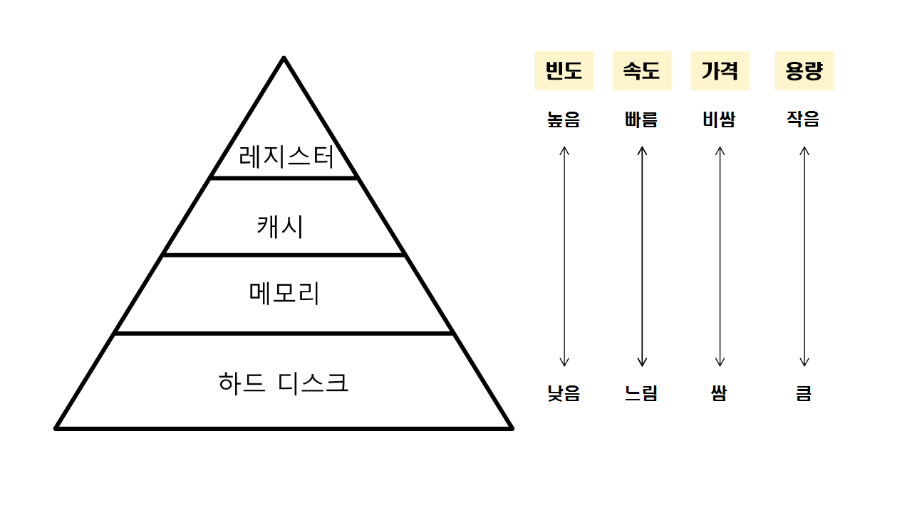

## 네트워크

### 1. 네트워크에서 패킷이란 무엇을 의미하나요?

- 네트워크를 통해 전송되는 형식화된 데이터 블록
  - 사용자 데이터
    - 페이로드(payload)
    - 애플리케이션을 대신하여 전달되는 데이터
    - 가변 길이
      - 네트워크 프로토콜
      - 라우팅 장비
  - 제어 정보
    - 페이로드를 전달하기 위한 정보
    - 패킷 헤더와 푸터에서 발견됨
    - 홉 제한(TTL, Time To Live)
      - 패킷이 통과할 때마다 1씩 감소하는 필드
      - 홉 제한이 0에 도달하면 전송 작업이 실패하고 패킷이 삭제된다.
    - 오류 감지 및 수정
      - 순방향 오류 수정: 수신자가 자동으로 오류를 수정하는 오류 수정 코드를 사용하는 것
      - 역방향 오류 수정: 수신자가 발신자에게 전체 데이터 단위를 재전송하도록 요청하는 것
      - 패킷이 전송되기 전에 송신기에서 한 번 계산, 대상에서 수신되면 체크섬이 다시 계산되어 패킷의 체크섬과 비교
    - 우선순위
      - 높은 우선순위 대기열은 네트워크가 혼잡할 때 낮은 우선순위 대기열보다 더 빨리 비워진다.
    - 주소
      - 송신 호스트의 소스 주소
      - 수신 호스트의 대상 주소
- 패킷을 지원하지 않는 컴퓨터 통신 연결은 단순히 바이트, 문자열, 비트를 독립적으로 연속하여 데이터를 전송한다.
- 데이터가 패킷으로 형식이 바뀔 때, 네트워크는 장문 메시지를 더 효과적이고 신뢰성 있게 보낼 수 있다.

&nbsp;

### 2. 네트워크에서 처리량은 무엇을 의미하나요?

- 특정 시간 동안 실제로 네트워크를 통과할 수 있는 평균 데이터 양
- 목적지에서 성공적으로 도착한 데이터 패킷의 수와 데이터 패킷 손실을 나타낸다.
- 처리량에 영향을 미치는 요인
  - 대역폭
    - 네트워크 용량이 전송 매체의 최대 대역폭에 도달하면 처리량이 해당 제한을 초과할 수 없다.
  - 처리 능력
    - 처리 성능을 향상시키는 특수 하드웨어 또는 소프트웨어 최적화로 더 많은 양의 트래픽과 더 복잡한 패킷 처리 태스크를 처리할 수 있게 된다.
  - 패킷 손실
    - 패킷이 손실되면 다시 전송해야하므로, 지연이 발생하고 네트워크 전체 처리량이 감소한다.
  - 네트워크 토폴로지
    - 네트워크 디바이스 수, 네트워크 링크의 대역폭, 네트워크 경로의 디바이스 간 거리를 나타낸다.
    - 잘 설계된 네트워크 토폴로지는 데이터 전송을 위한 다중 경로를 제공하고 트래픽 병목 현상을 줄이며 처리량을 증가시킨다.

&nbsp;

### 3. 지연시간이란 무엇인가요?

- 네트워크를 통해 데이터를 전송하는 데 걸리는 시간
- 지연이나 랙이 길게 발생하는 네트워크는 지연 시간이 길고, 응답 시간이 빠른 네트워크는 지연 시간이 짧다.
- 네트워크 지연의 원인
  - 전송 매체
    - 지연 시간에 가장 큰 영향을 미친다.
      - 예시: 광섬유 네트워크가 무선 네트워크보다 빠르다.
  - 네트워크 트래픽 이동 거리
    - 네트워크 엔드포인트 간의 거리가 멀면 네트워크 지연 시간이 증가
  - 네트워크 홉 수
    - 중간 라우터가 여러 개인 경우 데이터 패킷에 필요한 홉 수가 증가하므로 네트워크 지연 시간 증가
  - 데이터 볼륨
    - 동시 데이터 볼륨이 많으면 네트워크 디바이스의 처리 용량이 제한될 수 있으므로 네트워크 지연 시간 증가
      - 예시: 인터넷과 같은 공유 네트워크 인프라 등
  - 서버 성능
    - 네트워크 문제가 아닌, 서버가 느리게 응답해서 생기는 지연

&nbsp;

### 4. 처리량은 어떤 상황에 영향을 받나요?

- 대역폭
  - 네트워크 용량이 전송 매체의 최대 대역폭에 도달하면 처리량이 해당 제한을 초과할 수 없다.
- 처리 능력
  - 처리 성능을 향상시키는 특수 하드웨어 또는 소프트웨어 최적화로 더 많은 양의 트래픽과 더 복잡한 패킷 처리 태스크를 처리할 수 있게 된다.
- 패킷 손실
  - 패킷이 손실되면 다시 전송해야하므로, 지연이 발생하고 네트워크 전체 처리량이 감소한다.
- 네트워크 토폴로지
  - 네트워크 디바이스 수, 네트워크 링크의 대역폭, 네트워크 경로의 디바이스 간 거리를 나타낸다.
  - 잘 설계된 네트워크 토폴로지는 데이터 전송을 위한 다중 경로를 제공하고 트래픽 병목 현상을 줄이며 처리량을 증가시킨다.

&nbsp;

### 5. 네트워크 병목현상은 무엇인가요?

- 네트워크 내에서 데이터의 흐름이 한계에 도달하여 전송 속도가 더 이상 향상되지 않거나, 지연 현상이 발생하는 상황
- 네트워크 요소나 경로에서 가장 처리능력이 낮거나 대역폭이 작은 부분에서 발생할 수 있다.
- 병목현상의 원인을 찾을 때, 네트워크 토폴로지는 중요한 기준이 될 수 있다.

&nbsp;

### 6. TCP/IP 가 무엇인가요? 각 계층에 대해서 설명할 수 있나요?

#### TCP/IP

- 인터넷에서 컴퓨터들이 서로 정보를 주고받는 데 쓰이는 통신규약의 모음: The Internet Protocol Suite
  - OSI 7 Layer 중에서 Layer 3, Layer 4를 다루는 프로토콜
  - HTTP, TCP, IP 등이 속한다.
- 패킷 통신 방식의 인터넷 프로토콜인 IP와 전송 조절 프로토콜인 TCP로 구성
  - IP는 패킷 전달 여부와 순서를 보장하지 않는다.
  - TCP는 IP 위에서 동작하는 프로토콜로, 데이터의 전달과 순서를 보장한다.
- IP 주소 체계를 따라 IP Routing으로 목적지에 도달하며 TCP를 통해 신뢰성을 유지하겠다.
- TCP의 신뢰성 보장은 3-way handshake와 연관되어 있다.
  1. 클라이언트 → SYN → 서버
  2. 클라이언트 ← SYN + ACK ← 서버
  3. 클라이언트 → ACK → 서버

#### OSI 7 Layer

1. 물리 계층
   - 전기적, 기계적, 기능적인 특성을 이용해 데이터를 전송
   - 통신 단위: 비트
   - 케이블, 리피터, 허브 등
2. 데이터 링크 계층
   - 물리 계층을 통해 송수신되는 정보의 오류와 흐름을 관리
   - 맥 주소를 가지고 통신
   - 통신 단위: 프레임
   - 브릿지, 스위치 등
3. 네트워크 계층
   - 데이터를 목적지까지 안전하고 빠르게 전달하는 기능(라우팅)
   - 경로 선택, 주소 결정, 패킷 전달
   - 통신 단위: 패킷
   - 라우터, L3 스위치 등
   - IP
4. 전송 계층
   - 신뢰성있는 데이터를 전송 보장
   - 오류검출 및 복구, 흐름제어, 중복 검사
   - 통신 단위: 세그먼트
   - L4 스위치 등
   - TCP, UDP
5. 세션 계층
   - 응용 프로세스가 통신을 관리하기 위한 방법 제공
   - 동시 송수신 방식(duplex), 반이중 방식(half-duplex), 전이중 방식(full-duplex) 통신
   - 체크 포인팅과 유휴, 종료, 재시작 등 수행
6. 표현 계층
   - 코드 간의 번역을 담당하여 데이터의 형식상 차이를 다루는 부담을 응용 계층으로부터 덜어준다.
   - 수신자 장치에서 적합한 애플리케이션을 사용해 송신자 장치로부터 온 데이터를 해석하기 위한 응용 계층 데이터 부호화, 변환
   - 수신자에서 압축을 풀 수 있는 방식으로 된 데이터 압축
   - 전송을 위한 암호화와 복호화
7. 응용 계층
   - 응용 프로세스와 직접 관계하여 일반적인 응용 서비스를 수행
   - FTP, HTTP, HTTPS, Telnet, SSH, SMTP, POP3, IMAP 등

&nbsp;

### 7. 전송 계층의 대표적인 방식은 무엇이 있고 어떤 차이가 있나요? (키워드: TCP, UDP)

#### TCP

- 연결 지향 방식 → 패킷 전송을 위한 논리적 경로를 배정
- 3-way handshake로 연결을 설정하고, 4-way handshake로 해제한다.
- 흐름 제어 및 혼잡 제어
- 1:1 통신
- 높은 신뢰성 보장
- UDP에 비해 느린 속도
- 전이중(full-duplex), 점대점(point-to-point) 방식

#### UDP

- 비연결형 서비스로 데이터그램 방식을 제공
- 정보를 보내거나 받는다는 신호 절차를 거치지 않는다.
- UDP 헤더의 checksum 필드를 통한 최소한의 오류 검출
- 1:1 or 1:N or N:N
- 낮은 신뢰성
- TCP에 비해 빠른 속도
- 신뢰성보다 연속성이 중요한 서비스에서 사용 (streaming)

&nbsp;

### 8. 계층 간 데이터 송수신 과정에 대해 설명할 수 있나요? (키워드: 캡슐화, 비캡슐화)

- 송신할 때 캡슐화, 수신할 때 비캡슐화

- 송신(캡슐화) - TCP/IP 4계층의 관점에서 설명
  - 애플리케이션의 데이터가 애플리케이션 계층에서 전송 계층으로 이동하면서 TCP(L4) 헤더가 붙으며 세그먼트 또는 데이터그램화 된다.
  - 전송 계층에서 인터넷 계층으로 가면서 IP(L3) 헤더가 붙으며 패킷화 된다.
  - 인터넷 계층에서 링크 계층으로 가면서 프레임 헤더와 트레일러가 붙어 프레임화 된다.

- 수신(비캡슐화) - TCP/IP 4계층의 관점에서 설명
  - 링크 계층부터 타고 올라오면서 프레임화 → 패킷화 → 세그먼트 또는 데이터그램화 → 메시지화되어 최종적으로 사용자에게 애플리케이션의 PDU인 메시지로 전달된다.

&nbsp;

### 9. 네트워크에서 PDU에 대해 알고 있나요?

- 프로토콜 데이터 단위: 데이터 통신에서 상위 계층이 전달한 데이터에 붙이는 제어 정보
  - 층 1(물리 계층) PDU – 비트(스트림)
  - 층 2(데이터 링크 계층) PDU – 전달정보(프레임)
  - 층 3(네트워크 계층) PDU – 패킷 혹은 UDP의 데이터그램
  - 층 4(전송 계층) PDU – TCP 세그먼트
  - 층 5-6-7 (응용 계층) PDU – 메시지, 데이터

&nbsp;

### 10. 로드밸런서란 무엇인가요?

- 서버에 가해지는 부하(=로드)를 분산(=밸런싱)해주는 장치 또는 기술
- 클라이언트-서버 모델에서 클라이언트와 서버 사이에 위치
- 클라이언트 수가 굉장히 많아서 서버가 모든 클라이언트의 요청을 신속하게 처리하기가 힘들 때 적용할 수 있다.
  - Scale up: 서버 자체의 하드웨어 성능을 업그레이드하는 것
    - 서버 자체 성능을 업그레이드하는 것은 하드웨어라는 특성 상 한계가 존재
    - 나중에는 하드웨어를 업그레이드하는 비용이 서버 한 대를 추가하는 비용보다 비싸지는 특이점이 온다.
  - Scale out: 하나의 서버가 아닌 다수의 서버를 사용하는 것
    - 늘어난 모든 서버에 트래픽이 골고루 퍼질 수 있도록 해줘야 한다. → 로드 밸런싱
- 로드밸런싱 알고리즘
  - 라운드로빈: 서버에 들어온 요청을 순서대로 돌아가며 배정
  - IP 해시: 클라이언트 IP 주소를 특정 서버로 매핑해서 요청을 처리
  - 최소 연결: 요청이 들어온 시점에 가장 적은 연결 상태를 보이는 서버에 우선적으로 트래픽 배분
  - 최소 응답시간: 서버의 연결 상태와 응답시간을 모두 고려하여 트래픽을 배분

&nbsp;

### 11. ARP란 무엇인가요?

- IP 주소를 이용해 MAC 주소를 알아내는 프로토콜 → 논리적 주소를 물리적 주소로 변환하는 주소 결정 프로토콜
- 반대로 MAC 주소를 이용해 IP 주소를 알아내는 RARP도 있다.

1. 호스트 A가 호스트 B의 MAC 주소를 얻으려면 ARP Request라는 특수 패킷을 **브로드캐스팅**한다.
   - 브로드캐스팅을 지속적으로 하게 된다면 네트워크 트래픽이 증가해 CPU의 부담을 줄 수 있기 때문에 최근에 얻은 IP 주소와 MAC 주소를 매핑해 보관하는 캐시 정보를 이용한다.
2. 호스트 B가 아닌 다른 호스트들도 모두 패킷을 받게 되는데 관계가 없기 때문에 무시하고, 호스트 B는 ARP Reply 패킷을 통해 MAC 주소를 호스트 A에게 회신한다.

&nbsp;

### 12. MAC 주소란 무엇인가요?

- 네트워크 세그먼트의 데이터 링크 계층에서 통신을 위한 네트워크 인터페이스에 할당된 고유 식별자
- 네트워크 인터페이스 컨트롤러(NIC)의 제조업체가 할당하며 하드웨어에 저장된다.
- 총 48비트로 구성되어 있으며, 8비트씩 6자리로 구분하여 표기한다.
  - 앞의 3자리는 제조사 코드, 뒤의 3자리는 기기 고유 코드

&nbsp;

### 13. NAT란 무엇인가요?

- 네트워크 주소 변환(Network Address Translation)
- IP 패킷의 TCP/UDP 포트 숫자와 소스 및 목적지의 IP 주소 등을 재기록하면서 라우터를 통해 네트워크 트래픽을 주고 받는 기술
- 사설 네트워크에 속한 여러 개의 호스트가 하나의 공인 IP 주소를 사용하여 인터넷에 접속하기 위해 사용 → 공인 IP 주소를 절약할 수 있다.
  - 인터넷은 공인 IP로만 연결되어 통신이 가능하기 때문에 사설 IP 주소를 공인 IP 주소로 변환
- 공개된 인터넷 망은 외부에서 내부로의 해킹이나 침입의 위험이 있는데, 내부망과 공개망 사이에 방화벽을 운영하여 외부 공격으로부터 내부 인터넷망을 지킬 수 있다.

&nbsp;

## HTTP

### HTTP란 뭔가요?

- 하이퍼텍스트 전송 프로토콜
- 네트워크 장치 간에 정보를 전송하도록 설계된 애플리케이션 계층 프로토콜
- 서버와 클라이언트의 사이에서 어떻게 메시지를 교환할지 정해 놓은 규칙
- 요청과 응답으로 구성되어 있다.

&nbsp;

### HTTP 프로토콜의 가장 큰 특징은 뭔가요?

1. 클라이언트-서버 구조
   - 클라이언트는 서버에 요청을 보내고 응답이 올 때까지 대기
   - 서버는 클라이언트에서 받은 요청에 대한 결과를 만들어 응답
2. 무상태성(Stateless)
   - 서버가 클라이언트의 상태를 저장하지 않는다.
   - 서버가 클라이언트의 이전 상태(Context)를 저장하고 있지 않기 때문에, 클라이언트는 요청을 보낼 때 추가적인 데이터를 전송해야 한다.
   - 서버는 별도의 추가 정보를 관리하지 않아도 되고, 다수의 요청 처리 및 서버의 부하를 줄일 수 있다.
3. 비연결성(Connectionless)
   - 요청 후 응답을 받는 즉시 연결을 종료한다.
   - 서버 유지 자원을 효율적으로 사용할 수 있다.

&nbsp;

### URL은 뭔가요?

- 웹에 게시된 리소스를 검색하기 위해 브라우저에서 사용하는 매커니즘
- 웹에서 주어진 고유 리소스 주소

1. 스키마: 브라우저가 리소스를 요청하는 데 사용해야 하는 프로토콜
2. 권한: `://`에 의해 스키마와 구분되며, 도메인과 포트가 포함된다.
   - 도메인: IP 주소도 사용될 수 있지만, 불편하기 때문에 일반적으로 도메인 이름을 사용한다.
   - 포트: 웹 서버의 리소스에 접근하는 데 사용되는 기술적인 게이트
3. 리소스 경로: 웹 초기에는 웹 서버의 실제 파일 위치를 나타냈으나, 요즘에는 물리적 실체가 없는 웹 서버가 추상적으로 처리
4. 매개변수: 웹 서버에 제공되는 추가 매개변수, `&` 기호로 구분된 키/값 쌍 목록
5. 앵커: 책갈피 역할을 하며, 브라우저가 해당 지점의 컨텐츠를 표시하도록 지시

&nbsp;

### HTTP/1.0 과 HTTP/1.1의 차이는 뭔가요?

- 연결 재사용: 단일 원본 문서 내로 포함된 리로스들을 표시하기 위해 더 이상 여러 번 연결을 열 필요가 없어졌다.
- 파이프라이닝 추가: 첫번째 요청에 대한 응답이 완전히 전송되기 전에 두번째 요청 전송이 가능해졌다. → 통신 지연 시간 단축
- 청크된 응답 지원

&nbsp;

### HTTP/1.1 과 HTTP/2.0의 차이는 뭔가요?

- 텍스트 프로토콜이 아닌 이진 프로토콜로, 읽을 수 없고 수동으로 만들 수도 없다.
- 다중 프로토콜로, 동일한 연결을 통해 병렬 요청을 수행할 수 있다.
- 헤더를 압축해 전송 데이터의 중복과 오버헤드가 제거된다.
- 서버가 서버 푸시라는 매커니즘을 통해 클라이언트 캐시에 데이터를 저장할 수 있다.

&nbsp;

### HTTPS는 HTTP랑 뭐가 다른가요?

- HTTP는 정보를 텍스트로 주고 받기 때문에 네트워크에서 전송 신호를 중간에서 탈취할 경우 데이터 유출이 발생할 수 있다. → 보안 취약점 해결을 위해 Secure Socket을 추가한 HTTPS가 등장
- 서버와 클라이언트 사이의 모든 통신 내용이 암호화된다. → SSL 또는 TLS 프로토콜을 통해 세션 데이터를 암호화하며, 기본 TCP/IP 포트는 443이다.

&nbsp;

### 심화) 공개키 (비대칭키) 방식이 뭔가요?

- HTTPS는 비대칭 암호화를 사용한다.
- 비대칭 암호화에는 두 개의 개별 키가 포함된다.
  - 하나의 키(공개 키)는 누구나 액세스할 수 있으며 암호화에 사용된다.
  - 두 번째 키(개인 키)는 수신자가 안전하게 보관하며 암호 해독에 사용된다.
- 비대칭 암호화는 대칭 암호화보다 느리지만 여러 사용자에게 키를 배포하기가 더 쉽다.

&nbsp;

## 운영체제

### 운영체제란 무엇인가요?

- 컴퓨터 시스템의 핵심 소프트웨어
- 컴퓨터 하드웨어와 응용 프로그램 간의 상효작용을 관리하고 제어하는 역할
- 사용자와 하드웨어 사이의 인터페이스를 제공해 효율적으로 응용프로그램이 동작하도록 지원
- 응용 프로그램이 원활하게 동작할 수 있도록 시스템 자원을 효율적으로 관리

&nbsp;

### 운영체제는 어떤 역할을 하나요?

1. 자원 관리
   - 컴퓨터 시스템의 하드웨어 자원을 효율적으로 관리
   - 여러 응용 프로그램이 동시에 실행될 수 있도록 CPU, 메모리, 저장장치 등 하드웨어의 자원을 할당/관리
2. 메모리 관리
   - 컴퓨터의 메모리를 효율적으로 관리하여 응용 프로그램이 필요로 하는 메모리 공간 할당
   - 메모리 할당과 해제, 가상메모리 관리 등
3. 프로세스 관리
   - 프로세스의 생성, 실행, 일시 정지, 시스템 중지 등의 작업 제어
   - 여러 프로세스 간의 자원 공유와 협력 관리
4. 디스크 및 파일 시스템 관리
   - 파일의 생성, 삭제, 복사, 이동 등의 작업 처리
   - 사용자 및 응용 프로그램이 데이터를 쉽게 관리할 수 있도록 데이터의 영구적인 저장과 접근을 제공
5. 입출력 관리
   - 입출력 장치와의 상호작용 관리
   - 입출력 장치의 성능을 최적화
6. 사용자 인터페이스
   - 사용자와 컴퓨터 간의 상호작용을 지원하는 사용자 인터페이스를 제공
   - 텍스트 기반의 터미널 환경(CLI)와 그래픽 사용자 환경(GUI)을 통해 사용자가 컴퓨터를 조작
7. 네트워킹
   - 컴퓨터 네트워크를 관리
   - 컴퓨터 간의 통신을 위한 네트워크 프로토콜을 지원
   - 인터넷 연결, 데이터 전송, 네트워크 보안 등을 관리
8. 오류 처리
   - 시스템 내/외부에서 발생하는 오류와 예외 상황을 처리
   - 프로세스의 비정상 종료, 메모리 오버플로우, 입출력 오류 등을 감지 및 처리
   - 시스템의 안정성과 신뢰성을 유지
9. 시스템 보안
   - 접근 제어, 사용자 인증, 암호화 등의 기능 제공
   - 불법적인 접근과 데이터 유출 등으로부터 시스템을 보호하고 안전한 환경을 제공

&nbsp;

### 운영체제는 어떤 구조로 이루어져 있나요?

- 인터페이스
  - 사용자의 명령을 컴퓨터에 전달하고 결과를 알려주는 소통 역할
  - GUI
  - CLI
- 커널
  - 컴퓨터 운영체제의 핵심이 되는 전반적인 프로그램
  - 프로세스 관리, 메모리 관리, 저장공간 관리, 연결된 장치 관리 등 컴퓨터에 속한 모든 자원을 관리하는 역할
- 시스템 콜
  - 커널을 보호하기 위해 만든 코드 집합
    - 사용자나 프로그램이 직접적으로 컴퓨터 자원에 접근하는 것을 막는다.
- 드라이버
  - 하드웨어 장치와 운영체제 간의 통신을 가능하게 하는 소프트웨어

&nbsp;

### 컴퓨터는 어떤 요소로 이루어져 있나요?

- CPU: 메모리에 저장된 명령어를 읽고, 해석/실행하는 역할
- 메모리: 현재 실행되는 프로그램의 명렁어와 데이터를 저장하는 요소
  - 명령어: 데이터를 움직이고 컴퓨터를 작동시키는 정보
  - 데이터: 컴퓨터가 이해하는 정적 정보(숫자, 문자, 이미지, 동영상 등)
- 보조기억장치: 물리적인 디스크가 연결되어 있는 기억 장치
  - 주 기억장치보다 느린 속도
  - 컴퓨터 전원을 끄더라도 저장된 데이터가 사라지지 않고 영구적으로 보관
- 입출력장치: 컴퓨터 외부에 연결되어 컴퓨터 내부와 정보를 교환하는 장치

&nbsp;

### CPU는 어떤 요소로 이루어져 있나요?

- 제어장치(Control Unit): 프로세서의 조작을 지시
- 산술 논리장치(ALU, Arithmetic Logic Unit): 연산 작업, 논리 연산
- 레지스터(Register): CPU가 요청을 처리하는 데 필요한 데이터를 일시적으로 저장하는 기억장치
  - 메모리 주소 레지스터(MAR): 주소 버스에 주소를 출력하기 전에 임시 저장하는 레지스터
  - 프로그램 카운터(PC): 다음 인출할 명령어 주소를 임시 저장하는 레지스터
  - 메모리 버퍼 레지스터(MBR): 데이터 버스에 데이터를 읽고 쓰기 위해 잠시 저장해두는 버퍼 레지스터
  - 명령어 레지스터(IR): 가장 최근에 인출된 명령어를 임시 저장하는 레지스터
  - 누산기(AC): 중간 산술 논리 장치 결과를 임시 저장하는 레지스터

&nbsp;

### CPU는 어떻게 동작하나요?

| 명령어  | 설명                                                                        |
| ------- | --------------------------------------------------------------------------- |
| fetch   | 메모리로부터 명령어와 데이터를 프로세스로 가져오는 단계                     |
| decode  | 명령어를 분석해서 처리할 컨트롤 신호를 만드는 단계                          |
| execute | 컨트롤 신호에 따라 실제로 연산, 처리, 메모리 읽기 또는 쓰기를 실행하는 단계 |

1. CPU는 각 클럭마다 Fetch, Decode, Execute를 반복한다.
2. PC에 있는 주소값으로 명령어를 IR에 저장하고 (Fetch)
3. IR에 있는 명령어를 해석한 후 (Decode)
4. AC에 연산에 사용할 데이터를 저장한다. (Execute)
5. 위 과정을 반복

&nbsp;

### 메모리란 무엇인가요?

- 컴퓨터에서 정보 처리를 위해 일시적으로 정보를 보관하는 기억 장치
- 좁은 의미로는 주 기억장치인 램(RAM)을 의미하지만, 넓은 의미로는 보조기억장치인 롬(ROM)을 포함하기도 한다.
- 주 기억장치인 램(RAM)의 용량이 부족할 경우를 대비해 하드디스크의 일부를 가상메모리로 사용할 수도 있다.

&nbsp;

### 메모리는 어떤 계층 구조로 이루어져 있나요?

- 레지스터
  - CPU가 요청을 처리하는 데 필요한 데이터를 일시적으로 저장하는 기억장치
- 캐시
  - L1 캐시, L2 캐시
  - 데이터나 값을 미리 복사해 놓는 임시 장소
  - 시스템의 효율성을 위해 사용
  - 속도가 빠른 장치와 느린 장치 사이에서 속도 차에 따른 병목 현상을 완화하기 위한 범용 메모리
- 주기억장치
  - 컴퓨터에서 수치, 명령, 자료 등을 기억하는 컴퓨터 하드웨어 장치
- 보조기억장치
  - 비휘발성, 순차접근이 가능한 컴퓨터의 보조기억장치
  - 가장 대중적이며 용량 대비 가격이 저렴

&nbsp;

### 메모리는 어떤 방식으로 데이터를 관리하나요?

1. 연속 메모리 할당
   - 할당과 제거를 반복하다보면 외부 단편화가 발생
   - 외부 단편화를 줄이기 위한 할당 방식
     - 최초 적합: 가장 처음 만나는 빈 메모리 공간에 프로세스 할당
     - 최적 적합: 빈 메모리 공간의 크기와 프로세스의 크기 차이가 가장 적은 곳에 프로세스를 할당
     - 최악 적합: 빈 메모리 공간의 크기와 프로세스의 크기 차이가 가장 큰 곳에 프로세스를 할당
2. 페이징
   - 메모리 공간이 연속적으로 할다오디어야 한다는 제약조건을 없애는 메모리 관리 전략
   - 논리 메모리는 고정 크기의 페이지, 물리 메모리는 고정 크기의 프레임 블록으로 나누어 관리
   - 프로세스가 사용하는 공간을 논리 메모리에서 여러 개의 페이지로 나누어 관리하고, 개별 페이지는 순서에 상관없이 물리 메모리에 있는 프레임에 매핑되어 저장
   - MMU(Memory Management Unit)의 재배치 레지스터 방식을 활용해 CPU가 마치 프로세스가 연속된 메모리에 할당된 것처럼 인식하도록 함
   - 내부 단편화 발생
3. 세그멘테이션
   - 페이징 기법과 반대로 논리 메모리에 물리 메모리를 같은 크기의 블록이 아닌, 서로 다른 크기의 논리적 단위인 세그먼트로 분할
   - 외부 단편화 발생
4. 세그멘테이션/페이징 혼용
   - 프로세스를 세그먼트로 나눈 다음 세그먼트를 다시 페이지 단위로 나누어 관리
   - 매핑 테이블을 두 번 거쳐야하므로 속도가 느려짐

[운영체제는 어떻게 메모리를 관리할까?](https://velog.io/@dongwookang/%EB%A9%94%EB%AA%A8%EB%A6%AC-%EA%B4%80%EB%A6%AC)
&nbsp;

## 프로세스와 스레드

### 프로세스가 뭔가요?

- 운영체제가 프로그램을 실행하기 위해 필요한 가장 작은 단위의 쓰레드, 메모리, 소스코드들의 집합
- 메모리에 올라와 실행되고 있는 프로그램의 인스턴스
- 각각 독립된 메모리 영역(Code, Data, Stack, Heap)을 할당받는다.
- 운영체제는 프로세스를 작업의 단위로 보고 자원들을 작업들에 적절히 분배
- 기본적으로 프로세스는 최소 1개의 스레드(메인 스레드)를 갖는다.

&nbsp;

### 스레드가 뭔가요?

- 프로세스 내에서 실행되는 여러 흐름의 단위
- 프로세스가 할당받은 자원을 이용하는 실행의 단위
- 스레드는 프로세스 내에서 각각 Stack만 할당받고, Code, Data, Heap 영역은 공유
  - 프로세스 내의 주소 공간(힙 공간 등)이나 자원들을 같은 프로세스 내에 스레드끼리 공유하면서 실행

&nbsp;

### 프로세스와 스레드는 어떤 차이가 있나요?

- 운영체제는 프로세스마다 각각 독립된 메모리 영역을 할당해주기 때문에 프로세스는 다른 프로세스의 변수나 자료에 접근할 수 없다.
  - 한 프로세스가 실행 중에 오류가 발생해서 프로세스가 강제 종료된다고 해도 다른 프로세스에 영향을 주지 않는다.
- 각각의 스레드는 별도의 스택을 가지고 있지만 힙 메모리는 서로 읽고 쓸 수 있다.
  - 스레드는 메모리 영역의 내용을 공유하기 때문에 어떤 스레드 하나에서 오류가 발생한다면 같은 프로세스 내의 다른 스레드 모두가 강제로 종료된다.
