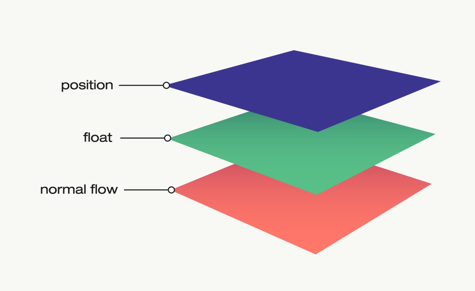

# HTML

## DOCTYPE

&nbsp;

### 1. DOCTYPE에 대하여 설명하시오

- Document Type Declaration(DTD)
  - HTML5는 DTD를 참조할 필요 없이 `<!DOCTYPE html>`로 선언할 수 있다.
- 문서 형식 선언
- 선언된 페이지의 HTML 버전이 무엇인지 웹 브라우저에 알려주는 역할을 하는 선언문

&nbsp;

### 2. meta 태그에 대해서 알고 있나요?

- 문서에 대한 정보인 메타데이터(metadata)를 정의할 때 사용
- `<head>`요소 내부에 위치

&nbsp;

### 3. meta 태그의 요소에 대해서 아는대로 말해보세요

1. `charset`:문서 인코딩에 사용한 문자 인코딩을 나타내는 "문자 집합 선언"
2. `content`: `http-equiv` 또는 `name` 특성의 값
3. `http-equiv`: HTTP 헤더가 제공하는 정보와 동일한 "프래그마 지시문"
   - `content-security-policy`: 허용할 서버 출처와 스크립트 엔드포인트를 지정
   - `content-type`: 지정할 경우, `content` 특성의 값은 반드시 `text/html; charset=utf-8`
   - `default-style`: 기본 CSS 스타일 시트 세트의 이름을 지정
   - `x-ua-compatible`: 지정할 경우, `content` 특성의 값은 반드시 `IE=edge`
   - `refresh`
     - `content` 특성의 값이 양의 정수인 경우: 페이지를 다시 불러오기 전가지의 초 단위 대기시간
     - `content` 특성의 값이 양의 정수를 가지고 그 뒤를 문자열 `;url=`과 유효한 URL이 뒤따를 때: 해당 URL로 이동하기 전까지의 초 단위 대기시간
4. `name`: 전체 페이지에 적용되는 "문서 레벨 메타데이터"
   - [표준 메타데이터 이름](https://developer.mozilla.org/ko/docs/Web/HTML/Element/meta/name)

&nbsp;

## 웹 표준 및 웹 접근성

### 1. 웹 표준이란?

- 웹에서 사용되는 기술들의 표준화
- 사용자가 어떤 브라우저나 기기를 사용하더라도 홈페이지 화면을 동일하게 볼 수 있도록 하는 것
- 웹 표준의 장점
  1. 웹 페이지의 호환성
  2. 검색 엔진 최적화(SEO)
  3. 유지보수 및 확장성
  4. 웹 접근성 향상
     - 모든 사용자가 쉽게 웹 페이지에 접근할 수 있도록 도움

&nbsp;

### 2. HTML5에서 추가된 내용이 있나요?

1. `DOCTYPE` 선언 변경 → `<!DOCTYPE html>`
2. 플래시 없이 비디오 및 오디오 기능을 자체적으로 지원
3. 서버와의 소켓 통신을 지원해 양방향 통신이 가능
4. `button`, `main`, `header`, `section`, `footer`, `article` 등의 시멘틱 태그 추가

&nbsp;

### 3. 웹 접근성이란?

- 장애를 가진 사람들도 신체적, 환경적 조건에 관계없이 인터넷을 통해 정보에 접근하고 이요할 수 있도록 하는 것
- 인터넷을 더욱 공평하고 인종, 성별, 연령, 장애 유무와 상관없이 모두가 이용할 수 있는 공간으로 만드는 것을 목표
- 웹 접근성을 위해 사용되는 보조기기: 자막, 스크린 리더, 자동완성 기능, 마우스 스틱, 색상 대비 디자인 등
- 웹 접근성 준수
  1. 시각적 요소 처리: 시각 장애인은 이미지, 비디오, 그래픽 등을 인식할 수 없으므로 대체 텍스트, 적절한 색상 대비, 텍스트 크기 등을 고려해 시각적 요소를 처리해야 한다.
  2. 청각적 요소 처리: 청각 장애인은 오디오 컨텐츠를 이해할 수 없으므로 자막, 수화, 오디오 설명 등을 제공해 청각적 요소를 처리해야 한다.
  3. 키보드 접근성: 지체 장애인은 마우스를 사용하지 못하므로 키보드만으로 웹 사이트를 이용할 수 있도록 구현해야 한다.
  4. 웹 접근성 검사: 웹사이트를 구축할 때, WCAG 준수 여부를 검사하여 웹 접근성을 확보할 수 있다.
     - WCAG(웹 콘텐츠 접근성 지침): 웹 접근성을 확보하기 위한 국제 표준
       1. 인식의 용이성
          - 텍스트가 아닌 컨텐츠에 대해 텍스트를 사람들이 원하는 인쇄, 점자, 음성, 기호 또는 간단 언어 등과 같은 형태로 제공해야 한다.
          - 정보와 구조의 손실 없이 컨텐츠를 다른 방식들로 표현할 수 있어야 한다.
          - 사용자들이 보다 쉽게 보고 들을 수 있는 전경에서 배경을 분리한 컨텐츠를 만들어야 한다.
       2. 운용의 용이성
          - 키보드로 모든 기능을 사용할 수 있도록 해야 한다.
          - 읽기 및 컨텐츠를 사용하는 사용자에게 충분한 시간을 제공해야 한다.
          - 사용자가 탐색하고, 컨텐츠를 찾고 그들이 어디에 위치하고 있는지를 알 수 있도록 도와주는 방법을 제공해야 한다.
       3. 이해의 용이성
          - 텍스트 컨텐츠를 판독하고 이해할 수 있도록 만들어야 한다.
          - 웹 페이지의 탑재와 운용을 예측 가능ㅇ한 방법으로 제작해야 한다.
          - 사용자의 실수를 방지하고 수정할 수 있도록 도와야 한다.
       4. 내구성
          - 웹 기술 사용, 호환성 검사, 오류 정정 등

&nbsp;

### 4. 웹 접근성에 맞는 마크업 예시 몇가지 말해보시오

1. Tailwind CSS는 스크린 리더를 위해 `sr-only`라는 클래스를 제공한다. (화면에는 보이지 않지만, DOM은 생성된다.)
   - 텍스트가 없는 아이콘 버튼 등에 설명을 제공하기 위해 사용
2. `img` 태그는 반드시 `alt` 속성을 포함해야 한다.
3. `svg` 태그는 반드시 `title` 태그 또는 속성을 포함해야 한다.
4. `header` 태그는 반드시 계층 순서를 지켜야 한다. (`h1` 이후에 바로 `h3`가 올 수 없다.)
5. 텍스트는 배경색과 충분히 대비가 돼야 한다.
6. 상호작용이 있는 요소는 `Tab` 키로 전환이 가능해야 한다.
7. `Tab` 키로 선택된 요소는 선택되었다는 것을 명확히 알 수 있도록 하이라이트되어야 한다.(Tailwind CSS의 경우, `ring` 등)
8. 적절한 시멘틱 태그를 사용한다.

&nbsp;

### 5. 시멘틱 태그란 무엇인가 왜 사용하는가

- 태그 내용에 의미를 부여하는 태그
- 웹 페이지에 보이는 것 이상의 정보를 제공
- 사람들은 코드를 읽는 것이 훨씬 쉬워지고, 검색 엔진은 컨텐츠를 더 쉽게 이해할 수 있다. (SEO 향상)
- 시멘틱 태그는 해당하는 `ARIA` 속성을 포함하고 있기 때문에 접근성 향상에도 유리하다.

&nbsp;

### 6. 텍스트 관련 태그

1. 줄바꿈이 일어나는 태그
   - `<h1> ~ <h6>`
   - `
`
   - `<pre>`: `white-space: "pre"`
   - `<blockquote>`
2. 줄바꿈이 일어나지 않는 태그
   - `<strong>`
   - `<b>`: bold
   - `<em>`: emphasize
   - `<i>`: italic
   - `<q>`: quote
   - `<mark>`
   - `<ruby`>

&nbsp;

### 7. SEO란 무엇인가?

- 웹사이트가 유기적인 검색 방식을 통해 검색 엔진에서 상위에 노출될 수 있도록 최적화하는 과정
- 검색 엔진은 웹페이지가 어떤 컨텐츠를 가지고 있는지, 해당 페이지가 무엇에 대한 것인지 판단하기 위해 인터넷을 통해 웹페이지를 크롤링하는 로봇인 웹 크롤러를 사용
- 검색 엔진은 검색자들이 찾고 있는 것뿐만 아니라 온라인에 이미 존재하는 다른 정보들을 기반으로 최상의 결과가 무엇인지 평가
- SEO는 더 많은 트래픽 유도와 브랜드 인지도 향상에 효과적인 방법으로 비즈니스 성장과 직결된다.

1. 웹 크롤러는 코드를 스캔하여 웹페이지에 표시되는 텍스트, 이미지, 동영상 등을 수집하여 가능한 모든 정보를 수집
2. 웹 크롤러가 각 페이지에서 사용할 수 있는 정보 유형에 대한 충분한 정보를 수집하여 해당 내용이 검색자에게 유용하다고 판단하면 해당 페이지를 색인에 추가

- SEO의 종류
  - Technical SEO: 웹사이트의 기술적 측면을 최적화
    - 검색 엔진이 웹사이트의 컨텐츠를 효과적으로 크롤링하고 인덱싱할 수 있게 하는 것에 중점
    - 사이트 로딩 속도, 모바일 친화성, XML 사이트맵, SSL 보안 등
  - On-page SEO: 웹페이지 내부의 컨텐츠와 HTML 소스 코드를 최적화
    - 컨텐츠를 더 관련성 높고 사용자 친화적으로 만드는 것을 목표
    - 키워드 최적화, 컨텐츠 품질, 메타 태그, 이미지 최적화 등
  - Off-page SEO: 웹사이트 외부 요소를 최적화
    - 백링크 구축에 중점
    - 다른 웹사이트들이 해당 사이트를 링크하는 것을 포함
      - 사이트의 권위를 높이고 검색 엔진 결과 페이지(SERP)에서의 순위를 개선하는 데 도움이 된다.

&nbsp;

### 8. Button 태그의 Default type은 무엇인가?

- 기본값은 버튼을 눌렀을 때 양식 데이터를 제출하는 `submit`이다.
- 양식 제출용 버튼이 아니라면 `type` 특성을 `button`으로 지정해야 한다.
- 기본값에서는 버튼을 눌렀을 때 양식 데이터를 제출하고, 존재하지 않는 응답을 불러오려고 시도하는 과정에서 문서의 현재 상태가 사라질 수 있다.

&nbsp;

### 9. Section 태그와 article 태그의 차이점

- `<section>`: 주제 별로 구분한 그룹
  - 문서를 다른 주제로 구분짓기 위해 사용
- `<article>`: 독립적인 내용
  - 블로그 글, 포럼 글, 뉴스 기사 등

&nbsp;

### 10. 크로스 브라우징이란 무엇인가요?

- 모든 브라우저에서 호환이 가능한 웹 페이지를 제작하는 것
- 브라우저마다 렌더링 엔진이 다르기 때문에 W3C의 웹 규격에 맞는 표준 웹 기술을 적용해 모든 브라우저, 기기에서 사이트가 의도된 대로 보여지게 해야한다.
- Tailwind CSS는 크로스 브라우징을 위한 스타일들을 지원한다.

&nbsp;

## 그 외

### 이미지 크기가 클 경우 렌더링 속도가 느려질텐데 이를 개선하기 위한 방법

- `squoosh`, `sharp` 등을 활용해 이미지를 압축
- `webp` 등으로 이미지 포맷 변경
- 알맞은 크기의 이미지 사용(반응형에서는 `srcset`과 `sizes`로 대응)
- 이미지 lazy loading하기(dataUrl 형태로 저화질 이미지를 표시하다가 이미지가 로드되면 고화질 이미지로 대체)
- CDN으로 캐싱해서 이미지 빠르게 불러오기

&nbsp;

### UI란 무엇인지 설명하시오

- 사용자 인터페이스
- 사람들이 컴퓨터와 상호작용하는 시스템

&nbsp;

## SVG란 ?

### SVG 장점과 단점

- Scalable Vector Graphics
- 2차원 **벡터 그래픽**을 서술하는 XML 기반 마크업 언어
- 장점
  - 빠른 웹사이트 로딩 속도: XML 코드이기 때문에 파일의 크기가 작다.
  - 벡터 그래픽: 래스터 그래픽과는 다르게 이미지 크기가 변경되어도 화질이 저하되지 않는다.
  - SEO 친화: XML은 키워드, 설명, 링크 등을 포함할 수 있어 검색 엔진 최적화에 유리하다.
  - 개발 효율: 디자이너와의 협업에서 강점이 있다.
  - CSS: CSS를 이용한 수정이 가능하다. (애니메이션도 가능)
- 단점
  - 최적화: 다양한 편집 도구에서 내보내진 SVG 파일에는 중복되고 쓸모없는 정보가 포함되어 있을 수 있다.
  - 복잡한 SVG의 비효율성: 많은 모양, 색상, 그래디언트 등을 포함하는 경우 이미지보다 파일의 크기가 커질 수 있다.

&nbsp;

### SVG 내부 도형에 대해 아는게 있나요?

- `rect`: 사각형
- `circle`: 원
- `ellipse`: 타원
- `line`: 직선
- `polyline`: 연결된 직선 그룹
- `polygon`: 다각형
- `path`: 다른 모든 종류의 모양, 베지어 곡선, 2차원 곡선 등

&nbsp;

---

&nbsp;

# CSS

## display

- 요소를 어떻게 보여줄지 레이아웃을 결정하는 속성으로 기본값은 `inline`이다.
- 모든 요소에서 사용할 수 있는 속성

> **Values**
>
> - `block`: 가로 영역을 모두 차지하여 항상 줄 바꿈이 되는 요소
>   - `width`와 `height`를 지정할 수 있다.
> - `inline`: 줄 바꿈이 되지 않으며, `width`와 `height`, 여백을 지정할 수 없다.
> - `inline-block`: `width`와 `height`을 지정할 수 있는 `inline` 요소
> - `none`: 렌더링되지 않는 요소
>   - CSS에서 `visibility: hidden`와 달리 영역을 차지하지 않는다.

&nbsp;

## position에 대하여 설명해보세요.

- HTML 문서에서 요소가 배치되는 방식을 결정하는 속성으로 기본값은 `static`이다.
- `top`, `right`, `bottom`, `left` 속성이 요소를 배치할 최종 위치를 결정한다.

> **Values**
>
> - `static`: 문서 흐름에 따라 배치
> - `relative`: 문서 흐름에 따라 배치하며, 자기 자신을 기준으로 `top`, `right`, `bottom`, `left`의 값에 따라 오프셋을 적용한다.
> - `fixed`: 요소를 일반적인 흐름에서 제거하고, 페이지 레이아웃에 공간을 배정하지 않는다.
>   - 뷰포트의 초기 컨테이닝 블록을 기준으로 배치한다.
>   - 최종 위치는 `top`, `right`, `bottom`, `left` 값이 지정한다.
> - `absolute`: 요소를 일반적인 흐름에서 제거하고, 페이지 레이아웃에 공간을 배정하지 않는다.
>   - 가장 가까운 위치 지정 조상 요소(`relative`)에 대해 상대적으로 배치한다.
>   - 최종 위치는 `top`, `right`, `bottom`, `left` 값이 지정한다.

&nbsp;

## float는 어떻게 작동하는가

- `float`: 텍스트와 이미지를 적절하게 배치하는 도구 (Microsoft의 Word, 한글과컴퓨터의 한글)

1. `float`를 적용하면 일반적인 흐름에서 요소가 제거된다.
   - `absolute`와는 다르게 일반적인 흐름에 있는 요소는 자동으로 영역이 재지정된다.
2. `float`를 사용하면 외부의 BFC가 `float` 요소의 `left`, `top` 값의 정보를 저장한다.
3. **BFC**(Block formatting context)는 `float`와 연관된 `block` 요소 내부의 `inline` 컨텐츠를 파악한 뒤, 저장해두었던 `float` 요소의 `left`, `top` 값에 맞게 **IFC**(Inline formatting contexts)로 변경하여 내부 컨텐츠에 배치한다.

> [!TIP]  
> **BFC? IFC?**  
> [Normal Flow? BFC? IFC?](https://jooonho.dev/web/2021-07-04-nomalflow-bfc-ifc/)

&nbsp;

## flex를 사용하는 이유가 무엇인가요?

- 1차원 레이아웃(행 **또는** 열)
- 유연하고 간단한 레이아웃을 구성할 수 있다.
- 반응형 웹

> 대부분 사이트는 전체 레이아웃이 수직 구성이며 '위-아래'로 스크롤 하여 사용합니다.
> 레이아웃을 구성할 때 가장 많이 사용하는 요소(Elements)들이 기본적으로 블록(Block) 개념으로 표시(Display)되며 이는 뷰(View)에 수직(위에서 아래로)으로 쌓이기 때문에 수직 구성은 상대적으로 쉽게 만들 수 있습니다.
> 하지만 수평(왼쪽에서 오른쪽으로) 구성의 경우는 상황이 조금 다릅니다.
>
> 문제는 수평 구조를 만드는 속성이 명확하지 않았기 때문인데, 그래서 많은 경우 `<table>`나 `float` 혹은 `inline-block` 등의 도움을 받았습니다.
> 하지만 이러한 방법들은 다양한 문제(Clear, White space 등, 해결은 가능하지만..)를 가지고 있기 때문에 결국 수평 레이아웃 구성의 차선책일 뿐이며, 이제 우리는 Flex(Flexible Box)라는 명확한 개념(속성들)으로 레이아웃을 쉽게 구성할 수 있습니다.
>
> 출처: [CSS Flex 완벽 가이드](https://www.heropy.dev/p/Ha29GI)

&nbsp;

## grid를 사용하는 이유가 무엇인가요?

- 2차원 레이아웃(행**과** 열)
- `flex`보다 더 복잡한 레이아웃을 구성할 수 있다.

&nbsp;

## 이미지 태그를 스타일로 대체하는 법

- `content` 또는 `background-img`를 통해서 대체할 수 있다.
- 하지만 이미지(전경처리)와 `background-img`(배경처리)는 장단이 있기 때문에 완벽히 대체할 수는 없다고 생각한다.
  - 전경처리가 유리한 경우
    1. 이미지에 구체적인 정보가 담겨있을 때(`alt` 등)
    2. 사용자가 등록하는 데이터 이미지일 때
    3. 인쇄 시 이미지까지 출력되어야 할 때
    4. 이미지의 크기가 레이아웃에 영향을 미칠 때
    5. 검색엔진에 이미지까지 노출이 필요할 때, 이미지검색 SEO
  - 배경처리가 유리한 경우
    1. 꾸밈 요소로만 사용할 때
    2. 성능 향상 (IR or Sprite)
